# HiveOS Roadmap 🗺️

> **Vision:** A Multi-Agent Operating System with a visual Playground, transparent Brain, self-learning capabilities, and pluggable domain knowledge.

---

## ✅ Done: Infrastructure (v0.1.0 — v0.6.0)

### Phase 0: Foundation ✅
| Task | Status | Notes |
|------|--------|-------|
| Product KB structure | ✅ | docs/ as Obsidian vault |
| Git init & version control | ✅ | GitHub: hossein1377mobini/hiveos-financial-brain |
| Hermes skill | ✅ | `hiveos-skill.md` — installable |
| Python package | ✅ | pyproject.toml, `uv pip install .` |
| Flow DSL + Validator | ✅ | YAML schema + structural validation |
| Flow Engine | ✅ | Topological sort, sequential agent execution |
| CLI (hive flow/package/util) | ✅ | 8 subcommands |
| Package builder/installer | ✅ | tar.gz format, manifest.yaml |

### Phase 1: Playground (CLI) ✅
- [x] Flow DSL v0.1
- [x] Flow Engine (Hermes delegate_task chain)
- [x] 3-agent demo flow
- [x] State persistence
- [x] Error handling (retry, cascade skip)

### Phase 2: Integration ✅
- [x] Hermes subagent spawning
- [x] State persistence with resume
- [x] Retry / cascade skip / status tracking
- [x] Knowledge sync (mothership → satellites)

### Phase 3: Packaging ✅
- [x] Package registry (YAML local catalog)
- [x] `hive package publish`
- [x] `hive registry` (list/search/info/remove/verify)
- [x] Remote registry client (HTTP)

### Phase 4: Mothership ✅
- [x] Agent Registry (capabilities, heartbeat)
- [x] Task Router (5 strategies)
- [x] Communication Bus (pub/sub, 2 backends)
- [x] Resilience (health checker, circuit breaker, reassignment)
- [x] Mothership Server (FastAPI REST API)
- [x] Mothership CLI (agent/route/bus/health/server)

### Phase 5: Enterprise ✅
- [x] RBAC (models, manager, server auth, CLI, 36 tests)
- [x] Audit Trail (JSONL + gbrain sync, 20 tests)
- [x] Dashboard (FastAPI + SPA, 23 tests)
- [x] Multi-tenant workspaces (38 tests)
- [x] Pricing model — license tiers (32 tests)

**Test total: 273** ✅

---

## ✅ v0.7.0: Playground + Brain + Learning

### Phase 6: Playground — Core APIs ✅
- [x] P-01: `POST /api/playground/validate` — Flow YAML validator
- [x] P-02: `POST /api/playground/auto-agents` — Task → domain agent matching
- [x] P-03: `GET /api/playground/templates` — Template browser
- [x] P-04: Visual Canvas (HTML5 Canvas + drag & drop in dashboard) ✅
- [x] P-05: Run/Debug + WebSocket streaming ✅

### Phase 7: Brain — Core Engine ✅
- [x] B-01: Event Stream Pipeline (agent lifecycle)
- [x] B-02: Decision Tracer (step-by-step path tracking)
- [x] B-03: Approval Gate Engine (create/approve/reject/expire)
- [x] B-04: Brain API (REST)
- [x] B-05: 3D Neural View (Three.js/WebGL in dashboard) ✅

### Phase 8: Learning — Passive Logger ✅
- [x] L-01: Execution Logger (in-memory collection + stats + trends)
- [x] L-02: Execution Analytics / Pattern Recognition ✅

---

## ✅ v0.12.0: Release Candidate (All layers complete)

### Phase D1: Accounting Domain ✅
- [x] Knowledge tree (200+ nodes, 10 branches A-J)
- [x] Domain manifest (29 agents, 6 flows)
- [x] Domain architecture docs
- [x] 29 agent blueprints (YAML)
- [x] 6 flow templates (YAML)
- [x] Hermes skills per agent (6 orchestrator SKILL.md files)
- [x] Agent auto-generation API
- [x] Template browser API

### Phase D2: Domain Registry ✅
- [x] `hive domain` (list/info/install/remove/init)
- [x] Domain registry (discover/shared)
- [x] Mothership domain loading
- [x] Cross-domain dependency resolution

### Phase S: Storage — SQLite Persistence ✅
- [x] S-01: SQLite StorageEngine
- [x] S-02: Persist Brain (EventStream, Traces, Gates)
- [x] S-03: Persist Learning (ExecutionLogs)
- [x] S-04: Persist Playground (FlowRuns)
- [x] S-05: Data directory init
- [x] S-06: Migration system

### Phase CL: Standardisation ✅
- [x] CL-01: CHANGELOG.md (Keep a Changelog format)
- [x] CL-02: CI (GA pytest on push)
- [x] CL-03: Auto-update skeleton (UpdateChecker, GitHub Releases)

### Phase 🎮 Playground UI (React Flow) ✅
- [x] Node Palette (4 categories: Trigger/Action/AI/Flow Control)
- [x] React Flow Canvas (snap-to-grid, connections)
- [x] Properties Panel (JSON editor)
- [x] Mini-map & Controls
- [x] Execution Trace panel
- [x] Toolbar (Templates, Run, Clear)
- [x] Execution Visualization (animated shimmer)
- [x] Design Tokens (Linear-inspired dark theme)
- [x] Backend Integration (FastAPI SPA)

### Phase 🪟 Desktop & Build ✅
- [x] Desktop Shell (pywebview native window)
- [x] PyInstaller → HiveOS.exe
- [x] MSI installer (Inno Setup)
- [x] PWA (manifest, Service Worker, offline fallback)

---

## 🎯 Development Model: Parallel Layers

Instead of sequential phases, **every build session advances all 5 layers together**:

## 🏁 Current Status: v0.12.0 Release Candidate

| Layer | Status |
|-------|--------|
| 🔧 **Engine** | ✅ Complete |
| 🧩 **Domains** | ✅ D1 + D2 Complete |
| 🎮 **Playground** | ✅ Full (APIs + UI) |
| 🧠 **Brain** | ✅ Full (Engine + 3D Viz) |
| 📈 **Learning** | ✅ Full (Logger + Analytics + Patterns) |
| 🗄️ **Storage** | ✅ SQLite Complete |
| 🪟 **Desktop** | ✅ 80% (Needs Code Signing, Tauri UI) |

### What's Left for v1.0.0

| Priority | Task | Status |
|----------|------|--------|
| 🟡 | Windows code signing (Authenticode) | Needs certificate |
| 🟡 | Tauri desktop shell (beautiful native UI) | Planned |
| 🟢 | First GitHub Release (v0.12.0) | Ready to cut |

## 🏁 Endgame: Windows Native Application

```mermaid
flowchart LR
    A[FastAPI + Jinja2] -->|Phase A| B[pywebview Shell]
    B -->|Phase B| C[React Flow UI]
    C -->|Phase C| D[PyInstaller .exe]
    D -->|Phase D| E[MSI Installer]
    E -->|Phase E| F[Auto-Update]
    F -->|Phase F| G[CI/CD Pipeline]
    style A fill:#f9f,stroke:#333
    style B fill:#9f9,stroke:#333
    style C fill:#9f9,stroke:#333
    style D fill:#9f9,stroke:#333
    style E fill:#9f9,stroke:#333
    style F fill:#9f9,stroke:#333
    style G fill:#9f9,stroke:#333
```



### Flow Components (from automation standards)

| Component | Description | Status |
|-----------|-------------|--------|
| **Trigger** | Manual, cron, webhook, event | Planned |
| **Task** | Agent action | Planned |
| **Condition** | If/else branch | Planned |
| **Switch** | Multi-branch routing | Planned |
| **Loop** | Repeat until condition | Planned |
| **Parallel** | Concurrent agent execution | Planned |
| **Join** | Sync parallel branches | Planned |
| **Approval Gate** | Human must approve/reject | Planned |
| **Timer** | Wait/delay | Planned |
| **Error Handler** | Retry, skip, abort, notify | Planned |
| **Subflow** | Nested flow | Planned |
| **Transform** | Map data between agents | Planned |

### Brain Features (Phased)

| Code | Feature | Priority |
|------|---------|----------|
| **B-01** | Event Stream — agent lifecycle events → streaming pipeline | ✅ |
| **B-02** | Decision Tracer — trace every decision path start→finish | ✅ |
| **B-03** | Approval Gate Engine — create→notify→approve/reject→log | ✅ |
| **B-04** | Brain API — REST + WebSocket endpoints | 🟡 |
| **B-05** | 3D Neural View — Three.js/WebGL | 🟡 |
| **B-06** | Real-time WebSocket streaming | 🟡 |
| **B-07** | Interactive exploration — click agents, inspect | 🟢 |
| **B-08** | Historical replay | 🟢 |

### Learning Features (Phased)

| Code | Feature | Priority |
|------|---------|----------|
| **L-01** | Execution logging (passive collection) | ✅ |
| **L-02** | Execution analytics — performance, bottlenecks | 🟡 |
| **L-03** | Pattern recognition → template suggestions | 🟢 |
| **L-04** | Knowledge accumulation — agents contribute to domain | 🟢 |
| **L-05** | Adaptive routing — smarter agent selection | 🟢 |

---

## 📊 Progress Summary

```
|Phase 0-5 (Infrastructure):   ██████████████████████████ 100% (273 tests)
|Layer 🗄️ Storage:             ██████████████████████████ 100% (S-01..S-06 done)
|Layer 🧩 Domains (D1/D2):     ██████████████████████████ 100% (D-04/D-05/D2 done)
|Layer 🎮 Playground:          ██████████████████████████ 100% (P-01..P-08 + UI)
|Layer 🧠 Brain:               ██████████████████████████ 100% (B-01..B-05 done)
|Layer 📈 Learning:            ██████████████████████████ 100% (L-01..L-03 done)
|Layer 🔧 Standardisation:     ██████████████████████████ 100% (CL-01/02/03 done)
|Layer 🪟 Windows Native:      ████████████████████████░░  80% (Needs signing)
```
