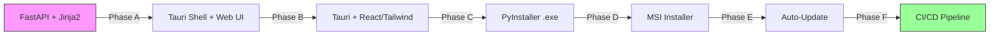

# HiveOS Roadmap 🗺️

> **Vision:** A Multi-Agent Operating System with a visual Playground, transparent Brain, self-learning capabilities, and pluggable domain knowledge.

---

## ✅ Done: Infrastructure (v0.1.0 — v0.6.0)

### Phase 0: Foundation ✅
| Task | Status | Notes |
|------|--------|-------|
| Product KB structure | ✅ | docs/ as Obsidian vault |
| Git init & version control | ✅ | GitHub: hossein1377mobini/hiveos-financial-brain |
| Hermes skill | ✅ | `hiveos-skill.md` — installable |
| Python package | ✅ | pyproject.toml, `uv pip install .` |
| Flow DSL + Validator | ✅ | YAML schema + structural validation |
| Flow Engine | ✅ | Topological sort, sequential agent execution |
| CLI (hive flow/package/util) | ✅ | 8 subcommands |
| Package builder/installer | ✅ | tar.gz format, manifest.yaml |

### Phase 1: Playground (CLI) ✅
- [x] Flow DSL v0.1
- [x] Flow Engine (Hermes delegate_task chain)
- [x] 3-agent demo flow
- [x] State persistence
- [x] Error handling (retry, cascade skip)

### Phase 2: Integration ✅
- [x] Hermes subagent spawning
- [x] State persistence with resume
- [x] Retry / cascade skip / status tracking
- [x] Knowledge sync (mothership → satellites)

### Phase 3: Packaging ✅
- [x] Package registry (YAML local catalog)
- [x] `hive package publish`
- [x] `hive registry` (list/search/info/remove/verify)
- [x] Remote registry client (HTTP)

### Phase 4: Mothership ✅
- [x] Agent Registry (capabilities, heartbeat)
- [x] Task Router (5 strategies)
- [x] Communication Bus (pub/sub, 2 backends)
- [x] Resilience (health checker, circuit breaker, reassignment)
- [x] Mothership Server (FastAPI REST API)
- [x] Mothership CLI (agent/route/bus/health/server)

### Phase 5: Enterprise ✅
- [x] RBAC (models, manager, server auth, CLI, 36 tests)
- [x] Audit Trail (JSONL + gbrain sync, 20 tests)
- [x] Dashboard (FastAPI + SPA, 23 tests)
- [x] Multi-tenant workspaces (38 tests)
- [x] Pricing model — license tiers (32 tests)

**Test total: 329** ✅

---

## ✅ v0.7.0: Playground + Brain + Learning

### Phase 6: Playground — Core APIs ✅
- [x] P-01: `POST /api/playground/validate` — Flow YAML validator
- [x] P-02: `POST /api/playground/auto-agents` — Task → domain agent matching
- [x] P-03: `GET /api/playground/templates` — Template browser
- [x] P-04: Visual Canvas (HTML5 Canvas + drag & drop in dashboard) ✅
- [x] P-05: Run/Debug + WebSocket streaming ✅

### Phase 7: Brain — Core Engine ✅
- [x] B-01: Event Stream Pipeline (agent lifecycle)
- [x] B-02: Decision Tracer (step-by-step path tracking)
- [x] B-03: Approval Gate Engine (create/approve/reject/expire)
- [x] B-04: Brain API (REST)
- [x] B-05: 3D Neural View (Three.js/WebGL in dashboard) ✅

### Phase 8: Learning — Passive Logger ✅
- [x] L-01: Execution Logger (in-memory collection + stats + trends)
- [x] L-02: Execution Analytics / Pattern Recognition ✅

---

## 🏗️ In Progress: v0.10.0 — Playground Enhancements + Windows Native Sprint

### Phase D1: Accounting Domain ✅
- [x] Knowledge tree (200+ nodes, 10 branches A-J)
- [x] Domain manifest (29 agents, 6 flows)
- [x] Domain architecture docs
- [x] 29 agent blueprints (YAML)
- [x] 6 flow templates (YAML)
- [x] Hermes skills per agent (6 orchestrator SKILL.md files)
- [x] Agent auto-generation API
- [x] Template browser API

### Phase D2: Domain Plugin CLI ✅
- [x] `hive domain` (list/info/install/remove/init)
- [ ] Domain registry (discover/shared)
- [ ] Mothership domain loading
- [ ] Cross-domain dependency resolution

### Phase D3: Next Domain ⏳
- [ ] Choose domain (medical, legal, engineering...)
- [ ] Build knowledge tree + agents + flows
- [ ] Publish to domain registry

---

## 🎯 Development Model: Parallel Layers

Instead of sequential phases, **every build session advances all 5 layers together**:

```
🧠     BRAIN       │ Event Stream · Decision Tracer · 3D Viz
🎮  PLAYGROUND     │ Validator · Auto-Agent · Canvas · Run/Debug
🔧    ENGINE       │ Core OS (CLI, Flow Engine, Mothership, Enterprise)
🧩    DOMAINS      │ Accounting D1 · Domain CLI · Next domains
📈   LEARNING      │ Logging · Analytics · Pattern Recognition
```

| Layer | What It Is | Next Session Focus |
|-------|-----------|-------------------|
| 🔧 **Engine** | Core ready ✅ | Maintenance (as needed) |
| 🧩 **Domains** | D1 Accounting + CLI ✅ | D2 Domain registry / Mothership loading |
| 🎮 **Playground** | Core APIs ✅ | P-07 Template Customizer · P-08 Flow Library |
| 🧠 **Brain** | Core Engine ✅ | 3D Neural View |
| 📈 **Learning** | Passive Logger ✅ | L-03 Pattern Recognition |

### Session N — First Build Sprint ✅ (v0.7.0 — Done)

| Layer | Scope | Status |
|-------|-------|--------|
| 🎮 Playground | **P-01** Flow Validator API · **P-02** Auto-Agent API · **P-03** Template Browser API | ✅ Done |
| 🧠 Brain | **B-01** Event Stream · **B-02** Decision Tracer · **B-03** Approval Gate Engine | ✅ Done |
| 🧩 Domains | **D-04** Hermes skills for accounting agents | ⏳ Next |
| 📈 Learning | **L-01** Execution logging (passive collection) | ✅ Done |

### Session N+1 — Canvas + Viz Sprint ✅ (v0.8.0 — Done)

| Layer | Scope | Status |
|-------|-------|--------|
| 🎮 Playground | **P-04** Visual Canvas (HTML5 Canvas) · **P-05** Run/Debug + WebSocket | ✅ Done |
| 🧠 Brain | **B-05** 3D Neural View (Three.js/WebGL) | ✅ Done |
| 🧩 Domains | **D-04** Hermes skills for accounting agents | ⏳ Next |
| 📈 Learning | **L-02** Execution analytics + pattern recognition | ✅ Done |

### Session N+2 — Data Persistence Sprint 🗄️ (v0.9.0)

| Layer | Scope | Status |
|-------|-------|--------|
| 🗄️ **Storage** | **S-01** SQLite StorageEngine ✅ · **S-02** Persist Brain (EventStream, Traces, Gates) ✅ | ✅ Done |
| 🗄️ **Storage** | **S-03** Persist Learning (ExecutionLogs) ✅ · **S-04** Persist Playground (FlowRuns) ✅ | ✅ Done |
| 🗄️ **Storage** | **S-05** Data directory init ✅ · **S-06** Migration system ✅ | ✅ Done |
| 🔧 **Standardisation** | **CL-01** CHANGELOG.md ✅ · **CL-02** CI (GA pytest on push) ✅ · **CL-03** Auto-update skeleton ✅ | ✅ Done |
| 🧩 **Domains** | **D-04** Hermes skills for 6 accounting orchestrators ✅ · **D-05** Domain Plugin CLI ✅ | ✅ Done |

### Session N+3 — Playground Features 🎮 (v0.10.0)

| Layer | Scope |
|-------|-------|
| 🎮 **Playground** | **P-07** Template Customizer — override parameters before running · **P-08** Flow Library — save/load/list user flows via StorageEngine |
| 🔧 **CLI** | `hive flow save/list/load/delete` commands for user flow library |
| 🗄️ **Storage** | FlowLibrary namespace in StorageEngine for persisting user-created flows |

### Session N+4 — Windows Native Sprint 🪟

| Layer | Scope |
|-------|-------|
| 🪟 **Shell** | Wrap web UI in Tauri desktop shell |
| 🎨 **UI** | Begin replacing Jinja2 with React/Tailwind components |
| 🔧 **Packaging** | PyInstaller → backend.exe + MSI installer (Inno Setup) |
| 🔄 **CI/CD** | GA workflow: test → build → sign → release to GitHub |

### Session N+5 — Polish & Ship 🚀 (v1.0.0)

| Scope |
|-------|
| Auto-updater (check GitHub Releases on startup, download + install) |
| Desktop-grade UI (all pages ported to React) |
| Code signing (Authenticode) |
| First public release on GitHub |

## 🏁 Endgame: Windows Native Application



### Flow Components (from automation standards)

| Component | Description | Status |
|-----------|-------------|--------|
| **Trigger** | Manual, cron, webhook, event | Planned |
| **Task** | Agent action | Planned |
| **Condition** | If/else branch | Planned |
| **Switch** | Multi-branch routing | Planned |
| **Loop** | Repeat until condition | Planned |
| **Parallel** | Concurrent agent execution | Planned |
| **Join** | Sync parallel branches | Planned |
| **Approval Gate** | Human must approve/reject | Planned |
| **Timer** | Wait/delay | Planned |
| **Error Handler** | Retry, skip, abort, notify | Planned |
| **Subflow** | Nested flow | Planned |
| **Transform** | Map data between agents | Planned |

### Brain Features (Phased)

| Code | Feature | Priority |
|------|---------|----------|
| **B-01** | Event Stream — agent lifecycle events → streaming pipeline | ✅ |
| **B-02** | Decision Tracer — trace every decision path start→finish | ✅ |
| **B-03** | Approval Gate Engine — create→notify→approve/reject→log | ✅ |
| **B-04** | Brain API — REST + WebSocket endpoints | 🟡 |
| **B-05** | 3D Neural View — Three.js/WebGL | 🟡 |
| **B-06** | Real-time WebSocket streaming | 🟡 |
| **B-07** | Interactive exploration — click agents, inspect | 🟢 |
| **B-08** | Historical replay | 🟢 |

### Learning Features (Phased)

| Code | Feature | Priority |
|------|---------|----------|
| **L-01** | Execution logging (passive collection) | ✅ |
| **L-02** | Execution analytics — performance, bottlenecks | 🟡 |
| **L-03** | Pattern recognition → template suggestions | 🟢 |
| **L-04** | Knowledge accumulation — agents contribute to domain | 🟢 |
| **L-05** | Adaptive routing — smarter agent selection | 🟢 |

---

## 📊 Progress Summary

```
|Phase 0-5 (Infrastructure):  ████████████████████████ 100%  (273 tests)
|Layer 🗄️ Storage:            ██████████████████████████ 100%  (S-01..S-06 done)
|Layer 🧩 Domains (D1):      ██████████████████░░░░░░  80%  (D-04/D-05 done)
|Layer 🎮 Playground:        ████████████████░░░░░░░░░  50%  (P-01..P-05 done)
|Layer 🧠 Brain:             ██████████████████░░░░░░░░  40%  (B-01..B-05 done)
|Layer 📈 Learning:          ██████████████████░░░░░░░░  40%  (L-01/L-02 done)
|Layer 🔧 Standardisation:   ██████████████████████████ 100%  (CL-01/02/03 done)
|Layer 🪟 Windows Native:   ░░░░░░░░░░░░░░░░░░░░░░░░░░   0%
```
