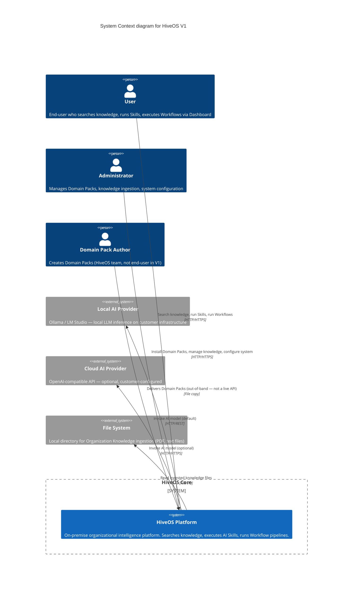

# 02 — System Architecture

> **Version:** 1.0.0  
> **Owner:** Principal Software Architect  
> **Status:** Complete (Phase 1)  
> **Last Updated:** 2026-07-24  
> **Upstream Sources:** `docs/01-Product/07-Architecture-Principles.md`, `docs/01-Product/08-Runtime-Architecture.md`, `docs/ADR/0001`–`0015`  
> **Dependencies:** 01-System-Vision  
> **Priority:** 2  

---

## Table of Contents

1. [System Context Diagram](#1-system-context-diagram)
2. [Container Diagram](#2-container-diagram)
3. [Core Services — Responsibility Table](#3-core-services--responsibility-table)
4. [Data Stores](#4-data-stores)
5. [Component Dependency Graph](#5-component-dependency-graph)
6. [Deployment Boundary](#6-deployment-boundary)
7. [External Integrations](#7-external-integrations)
8. [Cross-References](#8-cross-references)

---

## 1. System Context Diagram



### 1.1 Actors

| Actor | Description |
|-------|-------------|
| **User** | Core end-user. Searches knowledge, runs single Skills, executes Workflow Templates. Boolean `is_admin` = false. All operations through Dashboard UI. |
| **Administrator** | Manages the HiveOS installation. Installs/updates/enables/disables Domain Packs. Ingests Organization Knowledge. Configures system settings (AI provider, knowledge paths). Boolean `is_admin` = true. (ADR-0013) |
| **Domain Pack Author** | HiveOS team member (or future third-party) who creates Domain Packs. Delivers packs out-of-band (file copy, not a live API). No runtime access to the running system. |

### 1.2 External Systems

| System | Role | Connection |
|--------|------|------------|
| **Local AI Provider** | Default AI inference engine. Ollama or LM Studio running on customer infrastructure. All data stays local. | HTTP/REST to `localhost:11434` (configurable per A5, A8) |
| **Cloud AI Provider** | Optional AI inference. OpenAI-compatible API. Requires explicit customer configuration and API key. | HTTPS to external endpoint (configurable per ADR-0003, ADR-0008) |
| **File System** | Organization Knowledge ingestion. Reads PDF + text files from configured directory. No live sync in V1 — ingestion triggered manually. | Local file I/O |

### 1.3 HiveOS System Boundary

Everything inside the HiveOS boundary is a Core service running on customer infrastructure. The boundary enforces:

- **No external network dependency by default** (A5). Cloud AI is explicitly configured.
- **No executable code crosses the boundary** (A3, ADR-0001, ADR-0012). Only declarative YAML and Markdown.
- **Domain Pack content is read-only** after installation (A10).
- **All data stays on customer premises** (P9, ADR-0008).

---

## 2. Container Diagram

```mermaid
C4Container
  title Container diagram for HiveOS V1

  Person(user, "User", "Dashboard user")
  Person(admin, "Administrator", "System admin")

  System_Boundary(hiveos, "HiveOS Core (single process)") {

    Container(gateway, "Core API Gateway", "FastAPI / Python", "HTTP entry point. Routes requests, authenticates, authorizes. Serves Dashboard SPA.")
    Container(dashboard, "Dashboard", "Web SPA (React / Svelte)", "Searchable knowledge workspace, Skill/Workflow invocation, Playground debug console, Domain Pack management UI, execution history log.")

    Container(skill_exec, "Skill Executor", "Python", "Central orchestrator for all Skill executions. 7 sub-phases: Loader, InputValidator, ContextBuilder, PromptCompiler, AIInvoker, OutputValidator, ExecutionRecorder.")
    Container(wf_runner, "Workflow Runner", "Python", "Iterates through Workflow steps sequentially. Calls Skill Executor for each step. No Skill execution logic of its own.")

    Container(knowledge_svc, "Knowledge Service", "Python + SQLite FTS5", "Unified search index for Domain + Organization Knowledge. Source-tagged records (domain:/org:). Read-only in V1 (write stub for V2).")
    Container(capability_svc, "Capability Service", "Python", "Registry + invoker for reusable system functions. V1: knowledge_search, file_reader, calculator, web_access.")
    Container(ai_provider_svc, "AI Provider Service", "Python", "Abstraction layer over AI model providers. Local adapter (Ollama/LM Studio) + Cloud adapter (OpenAI-compatible).")
    Container(history_svc, "Execution History Service", "Python + SQLite", "Append-only persistence of complete Execution Contexts. Immutable records, no UPDATE.")
    Container(domain_mgr, "Domain Pack Manager", "Python", "Install/update/enable/disable/remove Domain Packs. Validates structure, registers Skills/Workflows/Knowledge.")
    Container(config_svc, "Configuration Service", "Python + YAML file", "Centralized configuration key-value store. Read-only for consumers, writable by admin.")

    Rel(gateway, dashboard, "Serves SPA", "HTTP")
    Rel(gateway, skill_exec, "POST /api/run/skill", "In-process call")
    Rel(gateway, wf_runner, "POST /api/run/workflow", "In-process call")
    Rel(gateway, domain_mgr, "POST /api/admin/packs/*", "In-process call")
    Rel(gateway, knowledge_svc, "GET /api/knowledge/search", "In-process call")
    Rel(gateway, history_svc, "GET /api/history/*", "In-process call")
    Rel(gateway, config_svc, "GET/PUT /api/admin/config", "In-process call")

    Rel(wf_runner, skill_exec, "execute_skill() per step", "In-process call")

    Rel(skill_exec, knowledge_svc, "search_knowledge() [via CapabilityService]", "In-process call")
    Rel(skill_exec, capability_svc, "invoke_capability()", "In-process call")
    Rel(skill_exec, ai_provider_svc, "invoke()", "In-process call")
    Rel(skill_exec, history_svc, "record_execution()", "In-process call")
    Rel(skill_exec, config_svc, "get_config()", "In-process call")

    Rel(domain_mgr, config_svc, "Updates pack registry", "In-process call")

    Rel(capability_svc, knowledge_svc, "search_knowledge()", "In-process call")
  }

  Rel(gateway, local_ai, "AI inference (default)", "HTTP/REST")
  Rel(gateway, cloud_ai, "AI inference (optional)", "HTTPS")
  Rel(domain_mgr, file_system_domain, "Read Domain Pack files", "File I/O")
  Rel(knowledge_svc, file_system_know, "Read Organization Knowledge files", "File I/O")

  UpdateRelStyle(gateway, local_ai, "dashed")
  UpdateRelStyle(gateway, cloud_ai, "dashed")
```

### 2.1 Deployment Model

V1 ships as a **single process** containing all Core services. Rationale (A-007):

- Simplest deployment: one Python process, one port.
- Sufficient for V1 concurrency: small team, single Business, single Domain Pack.
- Service-oriented architecture (A2) means services are logically separated via interfaces. Physical separation to multiple processes is a configuration change, not a code change.
- Horizontal scaling deferred to V2 if single-process bottleneck emerges.

Communication inside the process is direct method calls through defined interfaces. No IPC, no HTTP between services — only between the API Gateway and external systems (AI providers).

---

## 3. Core Services — Responsibility Table

### 3.1 Core API Gateway

| Attribute | Specification |
|-----------|--------------|
| **Responsibility** | Single HTTP/HTTPS entry point for all external requests. Authenticates, authorizes, routes to appropriate Core service. Serves Dashboard SPA. |
| **Technology** | FastAPI (Python) |
| **Default Port** | `8080` (configurable, A8) |
| **Routes** | `/api/run/skill` → Skill Executor, `/api/run/workflow` → Workflow Runner, `/api/knowledge/*` → Knowledge Service, `/api/history/*` → Execution History, `/api/admin/*` → admin operations (Domain Pack Manager, Configuration Service), `/` → Dashboard SPA |
| **Authentication** | Bearer token (JWT). `is_admin` boolean claim for authZ (ADR-0013). |
| **Boundaries** | Does NOT implement business logic. Pure routing + auth + middleware layer. |
| **References** | ADR-0013 (RBAC), A2 (Service-Oriented) |

### 3.2 Skill Executor

| Attribute | Specification |
|-----------|--------------|
| **Responsibility** | Central orchestrator for all Skill executions. Single execution path (A1, ADR-0005). |
| **Sub-phases** | SkillLoader → InputValidator → ContextBuilder → PromptCompiler → AIInvoker → OutputValidator → ExecutionRecorder |
| **Interface** | `execute_skill(skill_id, input_parameters, context?) → ExecutionContext` |
| **State** | Stateless. All execution state in Execution Context (ADR-0011). |
| **Dependencies** | Knowledge Service (via Capability Service), Capability Service, AI Provider Service, Execution History Service, Configuration Service |
| **Boundaries** | Does NOT implement Workflow logic. Does NOT store data. Does NOT serve HTTP. |
| **References** | ADR-0005, ADR-0011, A1 (Single Execution Path), §3 of this document |

### 3.3 Workflow Runner

| Attribute | Specification |
|-----------|--------------|
| **Responsibility** | Executes Workflow Templates by calling Skill Executor for each step in sequence. |
| **Interface** | `execute_workflow(workflow_id, input_parameters) → ExecutionContext` |
| **State** | Stateless. Step results stored in Workflow-level Execution Context. |
| **Dependencies** | Skill Executor (only — does NOT call other services directly) |
| **Boundaries** | Does NOT implement Skill execution (ADR-0006). Does NOT support branching, parallel steps, or error handlers in V1. |
| **References** | ADR-0006, A1 |

### 3.4 Knowledge Service

| Attribute | Specification |
|-----------|--------------|
| **Responsibility** | Unified search index for Domain Knowledge + Organization Knowledge. Source-tagged records. |
| **Interface** | `search_knowledge(query, filters?, limit?) → KnowledgeDocument[]`, `get_knowledge_by_id(id) → KnowledgeDocument` |
| **State** | SQLite FTS5 index. Knowledge documents stored with source tags (`domain:` / `org:`). |
| **Dependencies** | File system (for Organization Knowledge files) |
| **Boundaries** | Read-only in V1. `create_knowledge` returns "not implemented" stub. Does NOT store Domain Pack files. Does NOT manage the merge — that's a query-time operation (A10). |
| **References** | ADR-0007 (Single Index), A10 (Storage Separation) |

### 3.5 Capability Service

| Attribute | Specification |
|-----------|--------------|
| **Responsibility** | Registry + invoker for reusable system-level functions. Skills declare required capabilities by ID (ADR-0004). |
| **Interface** | `invoke_capability(id, input) → CapabilityResult`, `list_capabilities() → CapabilityInfo[]`, `get_capability(id) → CapabilityInfo` |
| **V1 Capabilities** | `knowledge_search`, `file_reader`, `calculator`, `web_access` |
| **State** | Static capability registry (no persistent state between invocations). |
| **Dependencies** | Knowledge Service (for `knowledge_search` capability) |
| **Boundaries** | Does NOT implement business logic. Does NOT know about Skills or Domain Packs. | 
| **References** | ADR-0004, Capability Layer Spec |

### 3.6 AI Provider Service

| Attribute | Specification |
|-----------|--------------|
| **Responsibility** | Thin abstraction layer over AI model providers. Receives compiled prompt, model_id, parameters. Returns generated content. |
| **Interface** | `invoke(prompt, model_id, parameters) → AIProviderResponse`, `get_provider_capabilities() → ProviderCapabilities` |
| **V1 Adapters** | Local (Ollama/LM Studio) — default. Cloud (OpenAI-compatible) — optional, configured. |
| **State** | Stateless. |
| **Dependencies** | Configuration Service (to read provider config) |
| **Boundaries** | Does NOT receive Skill definitions, Domain Pack structure, or internal system state. Only compiled prompt + model config. Does NOT do orchestration — orchestration lives in Skill Executor. |
| **References** | ADR-0003, AI Provider Spec |

### 3.7 Execution History Service

| Attribute | Specification |
|-----------|--------------|
| **Responsibility** | Append-only persistence of complete Execution Contexts. Immutable audit trail. |
| **Interface** | `record_execution(context) → record_id`, `get_execution(record_id) → ExecutionRecord`, `query_executions(filters) → ExecutionRecord[]` |
| **State** | SQLite database. Append-only — records NEVER modified after creation. Indexed by id, skill_id, workflow_id, status, started_at. |
| **Dependencies** | None (self-contained storage) |
| **Boundaries** | Does NOT call external services (A6). Does NOT implement pattern detection or learning — that's V2+. Does NOT delete or update records. |
| **References** | ADR-0002, ADR-0011 |

### 3.8 Configuration Service

| Attribute | Specification |
|-----------|--------------|
| **Responsibility** | Centralized configuration key-value store. Every settable parameter is config, not code (A8). |
| **Interface** | `get_config(key) → value`, `set_config(key, value)` |
| **State** | YAML file (V1). Config key-value pairs with types, defaults, scope. |
| **Dependencies** | None |
| **Boundaries** | Read-only for consumers (Skill Executor, AI Provider, etc.). Writable only by admin via API Gateway. |
| **References** | A8, ADR-0008 (on-premise default) |

### 3.9 Domain Pack Manager

| Attribute | Specification |
|-----------|--------------|
| **Responsibility** | Lifecycle management of Domain Packs: install, update, enable, disable, remove. Validates pack structure on install. |
| **Interface** | `install(path)`, `update(pack_id, path)`, `enable(pack_id)`, `disable(pack_id)`, `remove(pack_id)`, `list() → DomainPackMetadata[]` |
| **State** | Pack registry (active/inactive status, install paths). |
| **Dependencies** | File system, Configuration Service (for pack registry) |
| **Boundaries** | Does NOT execute Skills or Workflows. Does NOT modify Domain Pack files after installation (read-only, A10). |
| **References** | ADR-0001, ADR-0010, ADR-0012 |

---

## 4. Data Stores

| Store | Technology | Content | Access Pattern | Owner |
|-------|-----------|---------|----------------|-------|
| **Domain Pack Storage** | File system (`domains/<id>/`) | Domain Pack files: `domain.yaml`, knowledge Markdown, Skill YAML, Workflow YAML, icon | Read-only after installation | Domain Pack Manager |
| **Organization Knowledge Storage** | File system (configurable path) | Customer-provided PDF + text files | Read at ingestion time | Knowledge Service |
| **Knowledge Index** | SQLite FTS5 | Unified search index with source-tagged records (`domain:` / `org:`) | Query-time join (A10) | Knowledge Service |
| **Execution History Database** | SQLite | Append-only immutable execution records | Append + read-only queries | Execution History Service |
| **Configuration Store** | YAML file | Configuration key-value pairs | Read by all services, write by admin | Configuration Service |

All stores are **local to the customer infrastructure** (ADR-0008). No cloud database dependency.

---

## 5. Component Dependency Graph

```mermaid
graph TD
  subgraph "Entry Points"
    GW[Core API Gateway]
    DASH[Dashboard SPA]
  end

  subgraph "Orchestration"
    SE[Skill Executor]
    WR[Workflow Runner]
  end

  subgraph "Supporting Services"
    KS[Knowledge Service]
    CS[Capability Service]
    AI[AI Provider Service]
    EH[Execution History Service]
    CFG[Configuration Service]
    DPM[Domain Pack Manager]
  end

  subgraph "External"
    LOCAL[Local AI Provider]
    CLOUD[Cloud AI Provider]
    FS[File System]
  end

  DASH --> GW
  GW --> SE
  GW --> WR
  GW --> KS
  GW --> EH
  GW --> CFG
  GW --> DPM

  WR --> SE

  SE --> CS
  SE --> AI
  SE --> EH
  SE --> CFG

  CS --> KS

  DPM --> CFG
  DPM --> FS
  KS --> FS

  AI --> LOCAL
  AI --> CLOUD
  AI --> CFG

  style SE fill:#1a1a2e,stroke:#e94560,stroke-width:2px
  style GW fill:#1a1a2e,stroke:#16213e,stroke-width:1px
```



**Dependency direction:** arrow points from caller to callee. The Skill Executor is the most-depended-upon service (both Workflow Runner and API Gateway depend on it), consistent with ADR-0005.

### Key Dependency Rules

1. **Workflow Runner depends ONLY on Skill Executor** (ADR-0006). It has zero knowledge of other services.
2. **Capability Service depends ONLY on Knowledge Service** (for `knowledge_search`). All other capabilities are self-contained.
3. **Skill Executor depends on 5 services** — it is the most connected component. This is intentional (ADR-0005): central orchestration concentrates coordination logic in one place.
4. **Domain Pack Manager depends ONLY on Configuration Service and file system.** It does not call any execution service.
5. **Configuration Service has zero dependencies** — consumed by all, depends on none.

---

## 6. Deployment Boundary

### 6.1 Single Process Model

All Core services run in a **single Python process** in V1. Rationale (per ADR-0008 and A-007):

- One FastAPI server process serving all routes.
- All inter-service communication is in-process method calls through defined Python interfaces.
- No IPC, no service mesh, no container orchestration in V1.
- Process management: systemd (Linux) or NSSM (Windows).

### 6.2 Network Ports

| Port | Protocol | Service | Default | Configurable |
|------|----------|---------|---------|--------------|
| `8080` | HTTP | Core API Gateway (main entry point) | Yes | Via config |
| `11434` | HTTP | Local AI Provider (Ollama) — external | Yes | Via config |
| `443` | HTTPS | Cloud AI Provider (external) | Yes | Via config |

All ports configurable via Configuration Service (A8). No other ports open by default.

### 6.3 On-Premise Packaging

- **Required:** Python 3.11+, SQLite, 8GB RAM (16GB recommended for local AI)
- **Default AI:** Local — Ollama with embedded model (configurable)
- **No container required** in V1 (Docker optional for deployment convenience)
- **No external DNS required** — all services resolve locally
- **No cloud dependency** — works fully air-gapped (A5)

### 6.4 V2 Scalability Path

When single-process model is insufficient, each Core service can be extracted to its own process:

1. API Gateway becomes a reverse proxy (nginx/Caddy) routing to service-specific ports.
2. Each service gets its own port and HTTP server.
3. Service interfaces remain the same — only transport changes (method call → HTTP call).

---

## 7. External Integrations

### 7.1 AI Providers

| Provider | Type | Connection | Authentication | Default? |
|----------|------|-----------|---------------|----------|
| Ollama | Local inference | `http://localhost:11434` | None | Yes |
| LM Studio | Local inference | `http://localhost:1234` | None | Configurable |
| OpenAI-compatible | Cloud inference | Customer-specified HTTPS endpoint | API key | No |

The AI Provider Service selects the active provider based on Configuration Service settings. Only one provider active at a time in V1 (no fallback, no multi-model routing).

### 7.2 File System Integration

| Integration | Path | Purpose | Access |
|-------------|------|---------|--------|
| Domain Pack directory | `domains/<pack_id>/` | Installed Domain Pack files | Read-only (DPM) |
| Organization Knowledge directory | `data/knowledge/` (configurable) | Customer-provided knowledge files | Read at ingestion |
| Configuration file | `config.yaml` | System configuration | Read by all, write by admin |

### 7.3 No External Integrations in V1

The following are explicitly **NOT integrated** in V1 (per deferred decisions and V1 Scope):

- No ERP/CRM/accounting software APIs (DD-006)
- No email servers
- No file synchronization services
- No external authentication providers (LDAP/SSO)
- No cloud databases
- No monitoring/observability backends

All integrations are V2+ scope.

---

## 7A. Technology Stack

| Layer | Technology | Rationale |
|-------|-----------|-----------|
| API framework | FastAPI (Python 3.11+) | Async-capable, auto-documentation, type-safe (Pydantic), mature ecosystem |
| Database | SQLite | Zero-config, file-based, FTS5 for full-text search, sufficient for V1 scale |
| Search index | SQLite FTS5 | Fast full-text search, no external dependency, source-tagged records |
| Configuration | YAML file | Simple, readable, no database dependency for config |
| Knowledge storage | Markdown files + SQLite FTS5 | Files as source of truth, SQLite as searchable index |
| Domain Pack storage | File system directory | Portable (A3, ADR-0010), inspectable, no registry |
| Dashboard | SPA (framework TBD) | Embedded HTML served by API Gateway (ADR-0014) |
| Process management | systemd (Linux) / NSSM (Windows) | Standard, well-understood, fits on-premise |
| Local AI | Ollama / LM Studio | Open-source, runs locally, HTTP API compatible |
| Logging | Python logging + structured JSON | Observability (A6), integrates with any log aggregation |

### 7B. API Gateway Middleware Chain

The Core API Gateway processes every incoming request through a middleware chain before routing:

```
Incoming HTTP Request
    │
    ▼
┌──────────────────────────────────┐
│ 1. CORS Middleware               │
│    - Allow Dashboard origin      │
│    - Handle preflight requests   │
└──────────────┬───────────────────┘
               ▼
┌──────────────────────────────────┐
│ 2. Request Logging Middleware     │
│    - Log method, path, timestamp │
│    - Assign request_id           │
└──────────────┬───────────────────┘
               ▼
┌──────────────────────────────────┐
│ 3. Authentication Middleware      │
│    - Extract Bearer token        │
│    - Validate JWT signature      │
│    - Reject if missing/expired   │
└──────────────┬───────────────────┘
               ▼
┌──────────────────────────────────┐
│ 4. Authorization Middleware       │
│    - Check is_admin for admin    │
│      routes (ADR-0013)           │
│    - Reject non-admin for        │
│      /api/admin/* routes         │
└──────────────┬───────────────────┘
               ▼
┌──────────────────────────────────┐
│ 5. Rate Limiting Middleware       │
│    - Per-user rate limits        │
│    - Configurable via A8         │
└──────────────┬───────────────────┘
               ▼
┌──────────────────────────────────┐
│ 6. Request Router                │
│    - Match path to service       │
│    - Extract path/query params   │
│    - Forward to service method   │
└──────────────────────────────────┘
```

### 7C. Data Flow Patterns

**Request-Response (synchronous):**
- User → Gateway → Service → Response → User
- Used for: Skill execution, Workflow execution, knowledge search, configuration read/write
- V1 default for all operations

**Fire-and-forget (async record):**
- Skill Executor → Execution History Service
- Non-blocking write. Failure logged but doesn't block the response.
- Used for: Execution history recording (§1.4)

**Read-only file access:**
- Domain Pack Manager → file system (Domain Pack read)
- Knowledge Service → file system (Organization Knowledge read)
- Configuration Service → YAML file
- All read-only in normal operation. Writes only on admin-triggered operations.

---

## 8. Cross-References

| Target | Relationship |
|--------|-------------|
| 01-System-Vision | Defines the engineering vision that this architecture realizes |
| 03-Runtime-Execution | Decomposes execution flow through these components |
| 04-Domain-Pack-Specification | Defines the static format managed by Domain Pack Manager |
| 05-Core-Services | Per-service interface definitions (depends on this component map) |
| 06-API-Reference | External API contracts wrapping these services |
| 07-Data-Models | Shared data schemas used by all services |
| 08-Contracts | Error envelope, naming conventions, versioning |
| 09-Configuration | Config key definitions consumed by these services |
| docs/01-Product/07-Architecture-Principles.md | A1-A10 are constraints on this architecture |
| docs/ADR/0005 | Skill Executor as central orchestrator |
| docs/ADR/0006 | Workflow Runner reuses Skill Executor |
| docs/ADR/0011 | Execution Context object |
| docs/ADR/0013 | Simplified RBAC (boolean is_admin) |

---

## Change History

| Version | Date | Author | Change |
|---------|------|--------|--------|
| 1.0.0 | 2026-07-19 | Principal Software Architect | Phase 1 outline |
| 1.1.0 | 2026-07-24 | Principal Software Architect | Complete content — C4 diagrams, service tables, dependency graph, ports, integrations |
