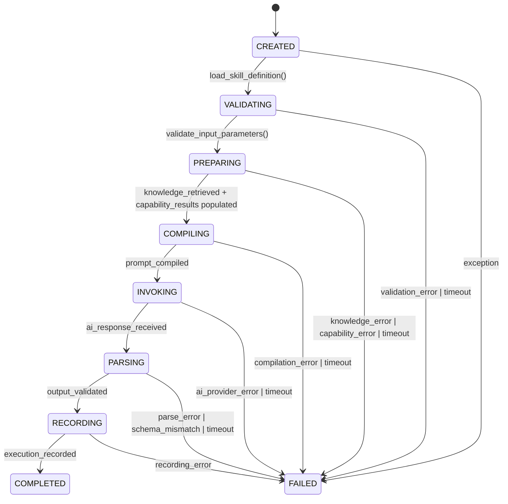
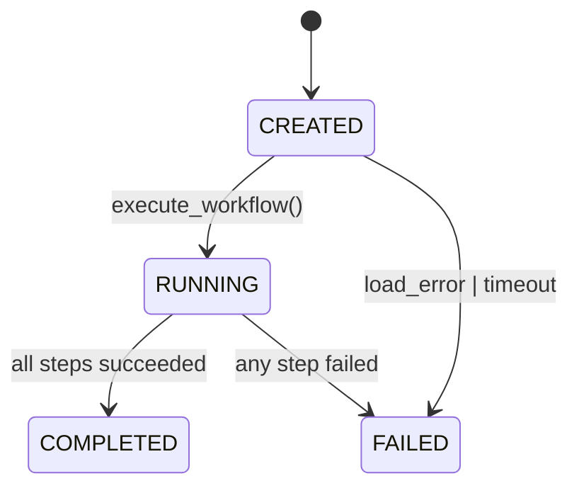
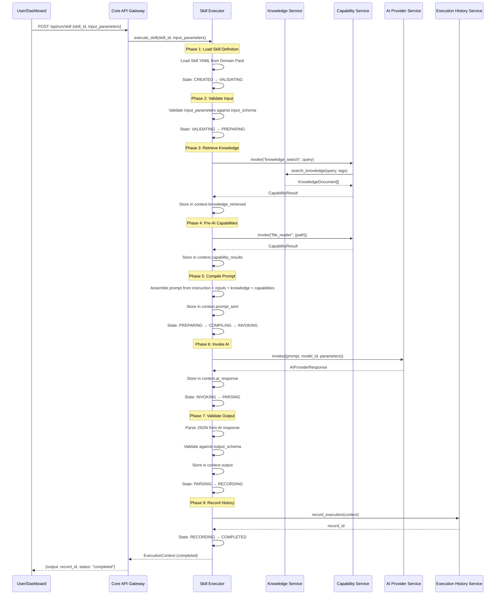
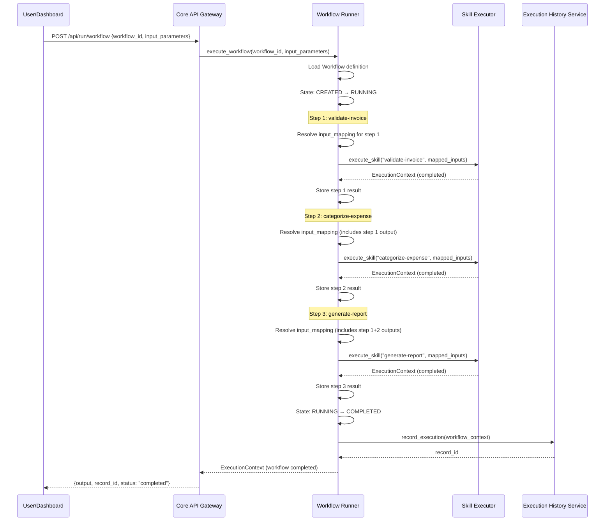
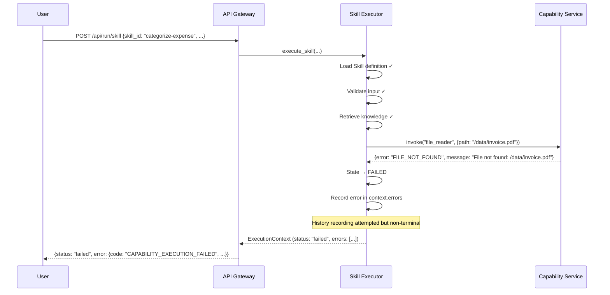
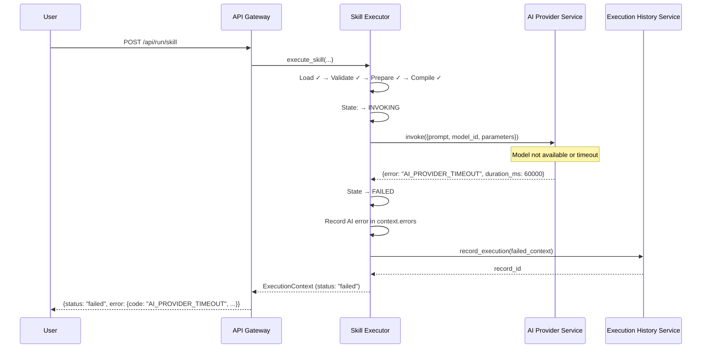

# 03 — Runtime Execution

> **Version:** 1.0.0  
> **Owner:** Principal Software Architect  
> **Status:** Complete (Phase 1)  
> **Last Updated:** 2026-07-24  
> **Upstream Sources:** `docs/01-Product/08-Runtime-Architecture.md`, `docs/ADR/0005`, `0006`, `0011`  
> **Dependencies:** 02-System-Architecture  
> **Priority:** 3  

---

## Table of Contents

1. [Skill Execution](#1-skill-execution)
   1.1 [State Machine](#11-state-machine)
   1.2 [Phase-by-Phase Specification](#12-phase-by-phase-specification)
   1.3 [Timeout Policy](#13-timeout-policy)
   1.4 [Error Propagation](#14-error-propagation)
   1.5 [Retry Semantics](#15-retry-semantics-v1)
2. [Workflow Execution](#2-workflow-execution)
   2.1 [State Machine](#21-state-machine)
   2.2 [Step-by-Step Specification](#22-step-by-step-specification)
   2.3 [Input Mapping Syntax](#23-input-mapping-syntax)
   2.4 [Output Mapping](#24-output-mapping)
3. [Execution Context Lifecycle](#3-execution-context-lifecycle)
   3.1 [Creation](#31-creation)
   3.2 [Population](#32-population)
   3.3 [Persistence](#33-persistence)
   3.4 [Archival](#34-archival)
   3.5 [Read-Only vs Mutable Phases](#35-read-only-vs-mutable-phases)
   3.6 [Schema Versioning](#36-schema-versioning)
   3.7 [Large Blob Strategy](#37-large-blob-strategy)
4. [Sequence Diagrams](#4-sequence-diagrams)
   4.1 [Single Skill Execution](#41-single-skill-execution)
   4.2 [Workflow Execution (3-Step Example)](#42-workflow-execution-3-step-example)
   4.3 [Error Scenario: Capability Failure](#43-error-scenario-capability-failure)
   4.4 [Error Scenario: AI Provider Failure](#44-error-scenario-ai-provider-failure)
5. [Cross-References](#5-cross-references)

---

## 1. Skill Execution

Every Skill execution — whether triggered from Dashboard, Workflow Runner, or Playground — follows the **same path** through the Skill Executor (A1, ADR-0005). There is exactly one way to run a Skill in HiveOS.

### 1.1 State Machine



**State definitions:**

| State | Description |
|-------|-------------|
| `CREATED` | Execution Context initialized. Skill not yet loaded. |
| `VALIDATING` | Skill definition loaded from Domain Pack. Input parameters being validated against `input_schema`. |
| `PREPARING` | Knowledge retrieved from Knowledge Service. Required capabilities invoked. Execution Context populated with context data. |
| `COMPILING` | Prompt assembled from instruction + user inputs + retrieved knowledge + capability results. Compiled prompt stored in Execution Context. |
| `INVOKING` | Compiled prompt sent to AI Provider Service. Waiting for AI response. |
| `PARSING` | AI response received. Parsed and validated against `output_schema`. Output stored in Execution Context. |
| `RECORDING` | Complete Execution Context sent to Execution History Service for immutable persistence. |
| `COMPLETED` | Execution finished successfully. Result returned to caller. Terminal state. |
| `FAILED` | Execution failed from any phase. Error recorded in Execution Context. Terminal state. |

**Transitions from FAILED:** No transitions. FAILED is a terminal state. Retry requires a new execution.

### 1.2 Phase-by-Phase Specification

#### Phase 1: Load Skill Definition

| Attribute | Specification |
|-----------|--------------|
| **Action** | SkillLoader reads Skill YAML from installed Domain Pack |
| **Input** | `skill_id` (from caller request) |
| **Output** | Parsed SkillDefinition: goal, instruction, input_schema, output_schema, required_capabilities, knowledge_requirements, model_config |
| **Validation** | Skill file exists, YAML valid, required fields present |
| **Error** | `SKILL_NOT_FOUND` if skill_id doesn't match any installed Skill. `SKILL_INVALID` if YAML malformed or missing required fields. |
| **ADR** | ADR-0001 (declarative content), ADR-0009 (embedded prompts) |

#### Phase 2: Validate Input Parameters

| Attribute | Specification |
|-----------|--------------|
| **Action** | InputValidator checks `input_parameters` against Skill's `input_schema` (JSON Schema subset) |
| **Input** | `input_parameters` (from caller), `input_schema` (from Skill definition) |
| **Output** | Validated, type-coerced parameters |
| **Validation** | Required fields present, types match, values within allowed ranges |
| **Error** | `INPUT_VALIDATION_FAILED` with details: which field failed, expected type, actual value. Execution Context set to FAILED. |
| **Note** | Basic type coercion applied (string "123" → integer 123). No data transformation beyond type coercion. |

#### Phase 3: Retrieve Knowledge

| Attribute | Specification |
|-----------|--------------|
| **Action** | ContextBuilder inspects `knowledge_requirements` (tags, concepts) from Skill definition |
| **Input** | `knowledge_requirements` from Skill, `input_parameters` for query context |
| **Internal call** | `CapabilityService.invoke("knowledge_search", {query, tags, limit})` → `KnowledgeService.search()` |
| **Output** | List of KnowledgeDocument results with source tags, relevance scores |
| **Storage** | Results stored in `ExecutionContext.knowledge_retrieved` |
| **Error** | `KNOWLEDGE_RETRIEVAL_FAILED` if Knowledge Service is unavailable. Partial results acceptable — execution continues with whatever was retrieved. |

**Knowledge retrieval design decisions:**
- Search uses keyword + relevance scoring (V1). No vector embeddings.
- Unified index queried at once — source tags (`domain:`, `org:`) returned for differentiation (ADR-0007).
- If no results match, execution continues with empty `knowledge_retrieved`. The prompt will not include domain context, which may affect AI output quality.

#### Phase 4: Invoke Pre-AI Capabilities

| Attribute | Specification |
|-----------|--------------|
| **Action** | ContextBuilder checks `required_capabilities` from Skill definition |
| **Internal call** | `CapabilityService.invoke(capability_id, input)` for each pre-AI capability |
| **V1 Capabilities** | `knowledge_search` (already invoked in Phase 3), `file_reader`, `calculator`, `web_access` |
| **Output** | Each CapabilityResult stored in `ExecutionContext.capability_results[capability_id]` |
| **Error** | `CAPABILITY_NOT_REGISTERED` if required capability not in Capability Service registry — terminal failure. `CAPABILITY_EXECUTION_FAILED` if capability returns error — terminal failure. |

**Capability execution order:** The Skill Executor invokes capabilities in the order they appear in `required_capabilities`. No parallel execution in V1.

#### Phase 5: Compile AI Prompt

| Attribute | Specification |
|-----------|--------------|
| **Action** | PromptCompiler assembles the complete AI prompt |
| **Components assembled** | (1) Skill instruction (embedded prompt template), (2) user `input_parameters`, (3) retrieved knowledge documents, (4) pre-AI capability results |
| **Assembly strategy** | Template interpolation. Skill instruction is the base prompt. Placeholders (`{{knowledge}}`, `{{input}}`, `{{capabilities}}`) filled with context data. |
| **Output** | Complete prompt string stored in `ExecutionContext.prompt_sent` |
| **Error** | `PROMPT_COMPILATION_FAILED` if template is malformed (should be rare — Skill validated on install) |

**Note:** V1 uses embedded prompts in Skill YAML (ADR-0009). Separate prompt asset files are deferred to V2+.

#### Phase 6: Invoke AI Provider

| Attribute | Specification |
|-----------|--------------|
| **Action** | AIInvoker sends compiled prompt to AI Provider Service |
| **Internal call** | `AIProviderService.invoke({prompt, model_id, parameters})` |
| **Model selection** | `model_id` from Skill's `model_config`. Fallback to global config from Configuration Service. |
| **Parameters** | `temperature`, `max_tokens` from Skill's `model_config`. Fallback to global defaults. |
| **Output** | AIProviderResponse stored in `ExecutionContext.ai_response`. Tokens, duration, model_used recorded. |
| **Error** | `AI_PROVIDER_FAILED` if provider returns error, times out, or is unreachable. No automatic retry in V1. No provider fallback in V1 (if local fails, does not try cloud). |
| **ADR** | ADR-0003 (AI Provider Abstraction) |

**AI Provider does NOT receive:** Skill definition, Domain Pack structure, execution state, or any HiveOS internal data. Only the compiled prompt + model configuration.

#### Phase 7: Parse and Validate Output

| Attribute | Specification |
|-----------|--------------|
| **Action** | OutputValidator parses raw AI response and validates against Skill's `output_schema` |
| **Parsing** | Expects structured JSON output from AI. Uses best-effort JSON extraction (finds JSON block in response text). |
| **Validation** | Parsed output checked against `output_schema` (JSON Schema subset). Required fields present, types match. |
| **Output** | Validated output stored in `ExecutionContext.output` |
| **Error** | `OUTPUT_PARSE_FAILED` if AI response is not valid JSON. `OUTPUT_VALIDATION_FAILED` if parsed JSON doesn't match schema. Both are terminal — execution set to FAILED. |

**Parsing strategy:**
1. AI response scanned for JSON block (wrapped in ````json ... ```` or bare `{}`/`[]`).
2. First valid JSON block extracted.
3. If no JSON found, raw string stored as `output.content` with a validation warning.
4. Validation is strict for required fields, lenient for optional fields.

#### Phase 8: Invoke Post-AI Capabilities

| Attribute | Specification |
|-----------|--------------|
| **Action** | Capabilities requiring AI output invoked after Phase 7 |
| **Examples** | Translation, data enrichment, formatting |
| **V1 usage** | Rare — most V1 Skills don't need post-AI capabilities |
| **Output** | Results stored in `ExecutionContext.capability_results` (appended) |
| **Error** | Same rules as Phase 4. Terminal failure. |

#### Phase 9: Record Execution History

| Attribute | Specification |
|-----------|--------------|
| **Action** | ExecutionRecorder sends complete Execution Context to Execution History Service |
| **Internal call** | `ExecutionHistoryService.record_execution(context)` |
| **Input** | Complete ExecutionContext with all phases populated |
| **Output** | `record_id` confirmation stored locally |
| **Error** | `HISTORY_RECORDING_FAILED` — logged as error but execution is still considered COMPLETED. The result is returned to caller. History failure is non-terminal. |
| **ADR** | ADR-0002 (execution over learning), ADR-0011 (Execution Context object) |

**Design decision:** History recording failure does NOT fail the execution. The user's result is more important than the audit trail. History failure is logged for investigation.

### 1.3 Timeout Policy

| Level | Default | Configurable | Behavior on Expiry |
|-------|---------|-------------|-------------------|
| **Total execution timeout** | 120 seconds | Yes (per-skill, A8) | `EXECUTION_TIMEOUT` error. State → FAILED. |
| **AI Provider invocation timeout** | 60 seconds | Yes (config) | `AI_PROVIDER_TIMEOUT` error. State → FAILED. |
| **Knowledge retrieval timeout** | 10 seconds | Yes (config) | `KNOWLEDGE_TIMEOUT` error. Execution continues with empty knowledge. |
| **Capability invocation timeout** | 30 seconds | Yes (per-capability) | `CAPABILITY_TIMEOUT` error. State → FAILED. |
| **Execution History recording timeout** | 5 seconds | Yes (config) | Logged as error. Execution still COMPLETED. |

**Timer management:**
- Total timeout wraps the entire execution. If any phase pushes past the total timeout, execution is FAILED immediately.
- Per-phase timeouts are independent. AI Provider has its own timeout inside the total timeout.
- Timeout values are read from Configuration Service at execution start (A8).

### 1.4 Error Propagation

| Error Category | Terminal? | Behavior |
|----------------|-----------|----------|
| Skill not found | Yes | Immediate FAILED. No Execution Context beyond creation. |
| Skill YAML invalid | Yes | Immediate FAILED. Logged. |
| Input validation failed | Yes | State → FAILED. Error details in ExecutionContext.errors. |
| Knowledge retrieval partial failure | No | Execution continues with available knowledge. Warning logged. |
| Knowledge retrieval total failure | Yes | State → FAILED. Cannot proceed without knowledge context. |
| Capability not registered | Yes | State → FAILED. Skill's `required_capabilities` cannot be met. |
| Capability execution failure | Yes | State → FAILED. Required pre-AI processing incomplete. |
| Prompt compilation failure | Yes | State → FAILED. Cannot generate valid prompt. |
| AI Provider failure | Yes | State → FAILED. No automatic retry (V1). |
| AI Provider timeout | Yes | State → FAILED. |
| Output parse failure | Yes | State → FAILED. AI response not in expected format. |
| Output validation failure | Yes | State → FAILED. Output doesn't match schema. |
| History recording failure | **No** | Execution COMPLETED. Error logged. Result still returned to caller. |

**Error response format:** All errors follow the ErrorEnvelope schema (see 07-Data-Models §10):
```json
{
  "code": "AI_PROVIDER_TIMEOUT",
  "message": "AI provider did not respond within 60000ms",
  "details": {
    "provider": "local",
    "model": "llama3.1",
    "timeout_ms": 60000
  },
  "transient": false
}
```

### 1.5 Retry Semantics (V1)

**V1: No automatic retry.** Rationale:

- Customer should explicitly decide to retry from the Dashboard.
- Automatic retry masks transient errors.
- Different errors need different retry strategies (timeout vs parse failure vs auth failure).
- Retry logic adds complexity disproportionate to V1's single-user, single-Domain-Pack usage pattern.

**V2 consideration:** Retry with exponential backoff for transient AI Provider errors only (network timeout, rate limit). Defined in a future ADR.

---

## 2. Workflow Execution

V1 Workflows are **sequential Skill pipelines**. No branching, no parallel steps, no error handlers, no conditionals. Each Workflow step calls the Skill Executor (ADR-0006).

### 2.1 State Machine



| State | Description |
|-------|-------------|
| `CREATED` | Workflow execution initialized. Definition loaded. |
| `RUNNING` | Steps executing sequentially. Tracks current step index. |
| `COMPLETED` | All steps completed successfully. Terminal state. |
| `FAILED` | Any step failed or workflow-level error. Terminal state. |

**Key constraint:** Step failure = Workflow failure (V1). There is no `on_error` behavior beyond "fail everything" in V1. Error handlers are deferred to V2.

### 2.2 Step-by-Step Specification

#### Step 2.1: Load Workflow Definition

| Attribute | Specification |
|-----------|--------------|
| **Action** | Workflow Runner reads Workflow YAML from installed Domain Pack |
| **Input** | `workflow_id` (from caller request) |
| **Output** | Parsed WorkflowDefinition: steps array, input_mapping, output_mapping |
| **Validation** | Workflow file exists, YAML valid, all referenced `skill_id` values resolve to installed Skills |
| **Error** | `WORKFLOW_NOT_FOUND`, `WORKFLOW_INVALID`, `SKILL_NOT_FOUND` (for referenced skills) |

#### Step 2.2: Create Workflow Execution Context

| Attribute | Specification |
|-----------|--------------|
| **Action** | Create Execution Context with `type: "workflow"` |
| **Fields** | `id: uuid`, `type: "workflow"`, `workflow_id`, `status: "running"`, `input_parameters`, `timestamps.started` |
| **Note** | Workflow Execution Context contains step results but each step creates its own Skill-level Execution Context internally. |

#### Step 2.3: Iterate Steps

For each step in the `steps` array (in order):

1. **Resolve input mapping:** Use JSON path expressions to map data from workflow inputs and previous step outputs to the current step's input parameters (§2.3).
2. **Call Skill Executor:** `SkillExecutor.execute_skill(step.skill_id, resolved_inputs, context={workflow_id, step_id, parent_execution_id})`.
3. **Store step result:** Skill Execution Context stored in `ExecutionContext.steps[step.id].output`.
4. **Check result:** If step status = `FAILED`, set workflow status = `FAILED` and return immediately.

#### Step 2.4: Workflow Completion

| Attribute | Specification |
|-----------|--------------|
| **On success** | Apply `output_mapping` to extract final result from last step. Set `status: "completed"`, `timestamps.completed`. |
| **On failure** | Set `status: "failed"`. Error details from failed step propagated. |
| **Record history** | Send complete Workflow Execution Context (with all step results) to Execution History Service. |
| **Return** | Workflow Execution Context output to caller. |

### 2.3 Input Mapping Syntax

Input mapping uses **JSON path expressions** to reference workflow inputs and previous step outputs:

```yaml
input_mapping:
  invoice_data: "$.input.invoice_data"           # Workflow-level input
  supplier_id: "$.input.supplier_id"              # Workflow-level input
  validation_result: "$.steps.validate.output"     # Previous step output
```

**Path expressions:**

| Pattern | Resolution |
|---------|-----------|
| `$.input.<field>` | Workflow-level input parameter |
| `$.steps.<step_id>.output.<field>` | Output from a previous step |
| `$.steps.<step_id>.output` | Complete output object from a previous step |

**Validation:**
- Paths are resolved at runtime before each step.
- If a referenced path doesn't exist, execution fails with `INPUT_MAPPING_RESOLVED_TO_NULL`.
- Only forward references are allowed (can't reference a step that hasn't run yet).

**V1 limitations:**
- No transformations or expressions in mapping — pure path extraction.
- No default values.
- No conditional mapping.

### 2.4 Output Mapping

After all steps complete, the `output_mapping` extracts the final result:

```yaml
output_mapping:
  report: "$.steps.generate-report.output"
  summary: "$.steps.validate.output.status"
```

If no `output_mapping` defined, the complete output of the last step is returned as the Workflow result.

---

## 3. Execution Context Lifecycle

The Execution Context is the **single source of truth** for a Skill or Workflow execution (ADR-0011). Every piece of data produced during execution is captured in this object.

### 3.1 Creation

```
ExecutionContext created at state = CREATED
├── id: uuid4
├── type: "skill" | "workflow"
├── skill_id: from request
├── workflow_id: from request (Workflow only)
├── status: "running"
├── timestamps.started: datetime.utcnow()
├── input_parameters: from request (validated)
└── errors: []
```

Created by Skill Executor at the start of every Skill execution. For Workflows, the Workflow Runner creates a workflow-level Context and each step creates its own Skill-level Context.

### 3.2 Population

The Execution Context is populated sequentially through execution phases:

```
Phase 3 (Knowledge Retrieval)
└── knowledge_retrieved: [{source, title, content, relevance_score}]

Phase 4 (Pre-AI Capabilities)
└── capability_results: {capability_id: {input, output, duration_ms, error?}}

Phase 5 (Prompt Compilation)
└── prompt_sent: string (complete compiled prompt)

Phase 6 (AI Invocation)
└── ai_response: {content, model_used, usage: {prompt_tokens, completion_tokens, total_tokens}, duration_ms, error?}

Phase 7 (Output Validation)
└── output: {} (validated JSON matching output_schema)

Phase 8 (Post-AI Capabilities)
└── capability_results: {} (appended with post-AI results)
```

### 3.3 Persistence

On execution completion (COMPLETED or FAILED):

1. Execution History Service receives the complete Execution Context.
2. Context is serialized to a full record including all populated fields.
3. Record is written to SQLite database (append-only).
4. `record_id` returned to Skill Executor.
5. Execution Context is detached from the running process — no longer needed.

**Timing of persistence:**
- Execution History is written **after** the result is returned to the caller.
- If persistence fails, the result is still delivered. History failure is non-terminal (§1.4).

### 3.4 Archival

V1: No archival policy. Records persist indefinitely (storage permitting). Index remains queryable.

V2: Configurable retention policy. Records older than retention period are archived to file export, then deleted from active index.

### 3.5 Read-Only vs Mutable Phases

| Phase | Execution Context state |
|-------|------------------------|
| CREATED | Read-only after creation (input_parameters locked). |
| VALIDATING | input_parameters may be type-coerced (not otherwise modified). |
| PREPARING | knowledge_retrieved, capability_results being populated. Context actively mutated. |
| COMPILING | prompt_sent being written. Context actively mutated. |
| INVOKING | ai_response being written. Context actively mutated. |
| PARSING | output being written. Context actively mutated. |
| RECORDING | Context fully populated. Read-only — sent to history as-is. |
| COMPLETED/FAILED | Context frozen. Final state sent to history. |

**Invariant:** Once a field is written, it is never overwritten (except during type coercion in VALIDATING). Fields are populated once per execution.

### 3.6 Schema Versioning

The Execution Context includes a `schema_version` field (integer). Schema version increments when fields are added, removed, or renamed.

| Version | Change |
|---------|--------|
| 1 | Initial schema (V1) |

**Compatibility rule:** Execution History Service can read any version ≥ current. Older records may have missing fields — readers must handle gracefully (default to null/empty).

### 3.7 Large Blob Strategy

| Field | Typical size | Large? | Strategy |
|-------|-------------|--------|----------|
| `prompt_sent` | 1-10 KB | Sometimes | Inline in record. Prompt >100KB truncated with `[TRUNCATED]` marker. |
| `ai_response.content` | 0.5-5 KB | Rarely | Inline in record. Response >100KB truncated. |
| `knowledge_retrieved` | 1-50 KB | Yes | References with IDs. Full content stored as separate indexed records. |
| `capability_results` | 0.1-5 KB | Rarely | Inline. Calculator results always small. FileReader could be large — capped at 50KB per file read. |

**Thresholds (configurable via A8):**
- Inline blob limit: 100 KB
- FileReader capability output limit: 50 KB
- Total Execution Context size limit: 1 MB (warn at 800 KB, hard cap at 1 MB)

---

## 4. Sequence Diagrams

### 4.1 Single Skill Execution



### 4.2 Workflow Execution (3-Step Example)



### 4.3 Error Scenario: Capability Failure



### 4.4 Error Scenario: AI Provider Failure



---

## 6. V2+ Placeholders

These sections are defined here to prevent V1 implementations from closing off V2 paths.

### 6.1 Streaming AI Responses (DD-0008)

**V1 status:** Not supported. Complete response processing only.

**V2 design direction:**
- AI Provider interface adds `stream_invoke()` returning an `AsyncIterator[Token]`.
- Execution Context stores final accumulated response (not token-by-token).
- Dashboard UI updates in real-time via WebSocket.
- Prompt compilation unchanged — only the AI invocation and output handling phases change.

**V1 guard:** The `AIProviderResponse` schema includes `content` as a complete string. V2 will add a `streaming: boolean` flag.

### 6.2 Workflow Branching and Parallel Steps

**V1 status:** Sequential only. No branching, no parallel steps.

**V2 design direction:**
- WorkflowDefinition adds `branch: {condition: expression, on_true: step_id, on_false: step_id}`.
- Parallel steps added via `parallel: [step_id, ...]`.
- Error handlers: `on_error: "skip" | "use_default" | "retry(3)" | "notify_human"`.

**V1 guard:** Step `on_error` field exists with only `"fail"` as valid value. V2 adds more enum values without breaking schema.

### 6.3 Learning from Execution History

**V1 status:** No pattern detection, no learning. Execution History is append-only data collection only (ADR-0002).

**V2 design direction:**
- New service: Pattern Detection Service.
- Input: `query_executions()` results from Execution History Service.
- Output: Detected patterns with confidence scores, evidence references.
- Human validation gate (ADR-0015, ADR-0016): patterns are recommendations, not truth.

**V1 guard:** Execution Context includes all fields needed for future pattern detection: full prompt, full response, capability results, knowledge retrieved, user feedback placeholder.

### 6.4 Custom Skill Authoring

**V1 status:** No custom Skills. All Skills come from installed Domain Pack.

**V2 design direction:**
- Dashboard UI for Skill creation/editing (not visual builder — ADR-0014).
- Custom Skills stored in `data/skills/` (separate from Domain Pack skills).
- Same Skill YAML format. Domain Pack Manager validates custom Skills against same schema.
- Custom Skills follow the same execution path through Skill Executor (A1).

**V1 guard:** SkillDefinition schema has no `source` field. V2 adds `source: "domain" | "custom"` to distinguish.

---

## 7. Cross-References

| Target | Relationship |
|--------|-------------|
| 02-System-Architecture | Services referenced here are defined in 02 |
| 05-Core-Services | Per-service interfaces implement these lifecycle phases |
| 06-API-Reference | Entry points that trigger these lifecycles |
| 07-Data-Models | Execution Context schema defined in 07 |
| 08-Contracts | Error envelope, naming conventions used here |
| docs/01-Product/08-Runtime-Architecture.md | Upstream source — this document adds state machines and phase boundaries |
| docs/ADR/0005 | Skill Executor as central orchestrator |
| docs/ADR/0006 | Workflow Runner reuses Skill Executor |
| docs/ADR/0011 | Execution Context object |
| docs/ADR/0002 | Execution over learning in V1 |
| docs/ADR/0007 | Single knowledge index with source tagging |
| docs/01-Product/18-Deferred-Decisions.md | DD-0003 (visual builder), DD-0005 (prompt assets), DD-0008 (streaming) |

---

## Change History

| Version | Date | Author | Change |
|---------|------|--------|--------|
| 1.0.0 | 2026-07-19 | Principal Software Architect | Phase 1 outline |
| 1.1.0 | 2026-07-24 | Principal Software Architect | Complete content — state machines, phase specs, timeout policy, error rules, sequence diagrams |
