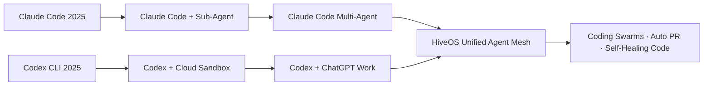

# Claude Code (Anthropic) و OpenAI Codex — دو عامل کدنویسی اصلی هوش مصنوعی

> **نویسنده:** تیم مستندات HiveOS  
> **تاریخ:** جولای ۲۰۲۶  
> **نسخه:** v1.0  
> **حوزه:** Coding Agents (عامل‌های کدنویسی)

---

## فهرست مطالب (Table of Contents)

1. [مقدمه — عصر عامل‌های کدنویسی](#introduction)
2. [Claude Code — عامل کدنویسی Anthropic](#claude-code)
   - [معرفی](#claude-intro)
   - [معماری و Agent Loop](#claude-architecture)
   - [قابلیت‌ها](#claude-capabilities)
   - [رابط خط فرمان (CLI)](#claude-cli)
   - [پشتیبانی از MCP](#claude-mcp)
3. [OpenAI Codex — عامل کدنویسی OpenAI](#openai-codex)
   - [معرفی](#codex-intro)
   - [معماری دو-حالته](#codex-architecture)
   - [قابلیت‌ها و CLI](#codex-capabilities)
   - [Sandbox و امنیت](#codex-sandbox)
4. [مقایسه چهار ابزار اصلی (Comparison)](#comparison)
   - [جدول مقایسه‌ای](#comparison-table)
   - [تحلیل تفاوت‌ها](#differences-analysis)
5. [چگونه عامل‌های کدنویسی درون‌ساخت کار می‌کنند](#how-they-work)
   - [Tool Use (استفاده از ابزار)](#tool-use)
   - [ویرایش فایل (File Editing)](#file-editing)
   - [اجرای Sandbox شده (Sandboxed Execution)](#sandboxed-execution)
6. [الگوهای یکپارچه‌سازی با HiveOS](#hiveos-integration)
7. [نقاط قوت و ضعف هر کدام](#strengths-weaknesses)
8. [چه زمانی از کدام استفاده کنیم؟ (برای توسعه ایرانی)](#when-to-use)
9. [نتیجه‌گیری](#conclusion)

---

<a name="introduction"></a>
## ۱. مقدمه — عصر عامل‌های کدنویسی (The Age of Coding Agents)

در سال‌های ۲۰۲۵ و ۲۰۲۶، صنعت نرم‌افزار شاهد یک **تغییر پارادایم (paradigm shift)** از ابزارهای **تکمیل خودکار کد (autocomplete)** به سمت **عامل‌های کدنویسی مستقل (autonomous coding agents)** بوده است. بر اساس آخرین نظرسنجی Stack Overflow، **۸۴٪ توسعه‌دهندگان** از ابزارهای هوش مصنوعی کدنویسی استفاده می‌کنند، اما تنها **۵۱٪** آن‌ها را به صورت روزانه به کار می‌برند — شکافی که نشان‌دهندهٔ فاصله بین شوق اولیه و بهره‌وری واقعی است.

دو بازیگر اصلی در این فضا **Anthropic** با **Claude Code** و **OpenAI** با **Codex CLI** هستند. هر دو یک گام فراتر از ابزارهای پیشین مانند GitHub Copilot رفته‌اند و نه فقط پیشنهاد خط کد، بلکه **انجام مستقل وظایف کامل (end-to-end task execution)** — از خواندن مخزن تا نوشتن کد، اجرای تست و ثبت Pull Request — را ممکن ساخته‌اند.

```
┌─────────────────────────────────────────────────────────┐
│                                                         │
│     تکامل ابزارهای کدنویسی هوشمند (Evolution)           │
│                                                         │
│  Copilot (Autocomplete)                                 │
│    ↓                                                    │
│  Cursor (IDE-Native Agent)                              │
│    ↓                                                    │
│  Claude Code / Codex CLI (Autonomous Terminal Agents)   │
│    ↓                                                    │
│  Multi-Agent Coding Swarms (HiveOS Vision) 🎯           │
│                                                         │
└─────────────────────────────────────────────────────────┘
```

این سند به بررسی عمیق این دو عامل، معماری داخلی، نقاط قوت و ضعف، و الگوهای یکپارچه‌سازی با HiveOS می‌پردازد.

---

<a name="claude-code"></a>
## ۲. Claude Code — عامل کدنویسی Anthropic

<a name="claude-intro"></a>
### ۲.۱ معرفی (Introduction)

**Claude Code** ابزار **عامل کدنویسی (coding agent)** شرکت **Anthropic** است که در فوریهٔ ۲۰۲۵ به عنوان یک research preview منتشر شد و طی سال ۲۰۲۵ تا ۲۰۲۶ به یک **پلتفرم توسعه چندعاملی (multi-agent development platform)** کامل تبدیل گردید. فلسفهٔ طراحی آن: **ترمینال (پایانه) واسط شماست، مخزن کد زمینه (context) شماست، و عامل workflow را سرتاسر انجام می‌دهد.**

| ویژگی | توضیح |
|-------|-------|
| **سازنده** | Anthropic |
| **اولین انتشار** | فوریه ۲۰۲۵ (Research Preview) |
| **زبان پیاده‌سازی** | TypeScript / Node.js |
| **مدل پیش‌فرض** | Claude Opus 4.8 / Sonnet 4.6 / Haiku 4.5 |
| **رابط اصلی** | CLI (ترمینال) — افزونه VS Code و JetBrains |
| **متن‌باز** | خیر (اما SDK منتشر شده) |
| **قیمت‌گذاری** | Pro $20/ماه — Max $100-200/ماه — API مصرفی |

> **نکته:** Claude Code شامل اشتراک Pro می‌شود و نیازی به هزینه جداگانه ندارد.

<a name="claude-architecture"></a>
### ۲.۲ معماری و Agent Loop (Architecture & Agent Loop)

معماری Claude Code بر اساس یک **حلقهٔ اصلی تک‌رشته‌ای (single-threaded master loop)** با کدنام داخلی `nO` طراحی شده است. این حلقه با یک **صف پیام ناهمگام (asynchronous message queue)** به نام `h2A` کار می‌کند که امکان **هدایت بی‌درنگ (real-time steering)** را فراهم می‌کند — یعنی کاربر می‌تواند در میان اجرای یک کار طولانی، دستورالعمل جدیدی تزریق کند بدون اینکه agent از صفر شروع کند.

```
┌──────────────────────────────────────────────────────┐
│           Claude Code — معماری لایه‌ای                │
├──────────────────────────────────────────────────────┤
│  ┌──────────────────────────────────────────────┐   │
│  │  لایه کاربر (User Interaction Layer)          │   │
│  │  CLI · VS Code Extension · Web UI · Slack    │   │
│  └──────────────┬───────────────────────────────┘   │
│                 │                                    │
│  ┌──────────────▼───────────────────────────────┐   │
│  │  Agent Core / Scheduling Layer                │   │
│  │  ┌──────────┐  ┌──────────┐  ┌──────────┐   │   │
│  │  │  Master  │  │   h2A   │  │ Tool    │   │   │
│  │  │ Loop nO  │◄─┤  Async  │  │ Engine  │   │   │
│  │  │          │  │  Queue  │  │   &     │   │   │
│  │  └──────────┘  └──────────┘  │Scheduler │   │   │
│  │                              └──────────┘   │   │
│  ├──────────────────────────────────────────────┤   │
│  │  StreamGen (خروجی زنده) · Compressor wU2    │   │
│  │  (فشرده‌سازی خودکار پنجره زمینه در ۹۲٪)     │   │
│  └──────────────────────────────────────────────┘   │
│                                                     │
│  ┌──────────────────────────────────────────────┐   │
│  │  لایه ابزار (Tool Layer)                      │   │
│  │  Bash · Grep · View · Edit · Task · MCP ·…  │   │
│  └──────────────────────────────────────────────┘   │
│                                                     │
│  ┌──────────────────────────────────────────────┐   │
│  │  لایه امنیت (Permission System)               │   │
│  │  7 حالت مجوز + ML-Based Classifier           │   │
│  └──────────────────────────────────────────────┘   │
└──────────────────────────────────────────────────────┘
```

**حلقهٔ اصلی Agent (The `nO` Master Loop):**

```python
# شبه‌کد حلقه اصلی Claude Code
def master_loop(user_input: str):
    context = build_initial_context(user_input)
    
    while True:
        response = model.generate(context)  # فراخوانی مدل
        
        if response.has_tool_call():
            # اجرای ابزار
            tool_result = execute_tool(response.tool_call)
            context.append(tool_result)
            
            # بررسی مصرف پنجره زمینه
            if context.usage_ratio() > 0.92:
                context = compressor.wU2.compress(context)
            
            continue  # بازگشت به ابتدای حلقه
        
        elif response.is_final():
            # پاسخ نهایی به کاربر
            return response.text
        
        else:
            # خطا یا نیاز به شفاف‌سازی
            context.append(ask_clarification())
```

**مکانیسم‌های کلیدی معماری:**

- **Compressor `wU2`:** هنگامی که مصرف پنجره زمینه (context window) به ~۹۲٪ می‌رسد، به طور خودکار مکالمات را خلاصه می‌کند و اطلاعات مهم را به **ذخیره‌سازی بلندمدت (long-term storage)** در یک فایل Markdown منتقل می‌کند.
- **Sub-Agent (زیرعامل):** فقط **یک زیرعامل در هر زمان** مجاز است. این محدودیت عمدی برای جلوگیری از «انفجار عامل‌ها» (agent proliferation) و حفظ قابلیت رفع اشکال (debuggability) اعمال شده است.
- **TODO List:** Claude می‌تواند از یک لیست کارهای TODO برای برنامه‌ریزی و ردیابی پیشرفت استفاده کند.

<a name="claude-capabilities"></a>
### ۲.۳ قابلیت‌ها (Capabilities)

| قابلیت | توضیح فارسی | English |
|--------|------------|---------|
| **تولید کد (Code Generation)** | نوشتن توابع، کلاس‌ها و کل پروژه‌ها از توضیحات | Writes complete code from natural language |
| **ویرایش هوشمند (Smart Editing)** | ویرایش چندفایلی با درک وابستگی‌ها | Multi-file editing with dependency awareness |
| **رفع اشکال (Debugging)** | تحلیل خطاها، پیشنهاد رفع و اجرای تست | Error analysis, fix suggestions, test execution |
| **مدیریت مخزن (Git/PR)** | ایجاد شاخه، کامیت، Pull Request | Branch, commit, and PR creation |
| **کاوش کدبیس (Codebase Exploration)** | جستجو و درک ساختار پروژه با Grep | Grep-based codebase understanding |
| **اجرای کامند (Bash)** | اجرای دستورات در ترمینال محلی | Local terminal command execution |
| **زیرعامل (Sub-Agent)** | واگذاری زیروظایف به عامل‌های موقت | Task delegation to temporary sub-agents |
| **برنامه‌ریزی (Planning)** | تحلیل و تدوین plan پیش از اجرا با `/think` | `/think` planning mode |
| **Slack Integration** | شروع تسک کدنویسی از پیام Slack | Kick off tasks from Slack messages |

**مثال استفاده — رفع باگ با Claude Code:**

```bash
# نصب
npm install -g @anthropic-ai/claude-code

# شروع یک جلسه
claude

# داخل جلسه: درخواست رفع باگ
> این باگ رو در فایل src/auth.ts پیدا و رفع کن:
   ارور "TypeError: Cannot read properties of undefined (reading 'length')"
   وقتی کاربر بدون sessionId وارد می‌شه

# Claude:
# 1. فایل src/auth.ts را می‌خواند (View)
# 2. تابع getSession را پیدا می‌کند
# 3. شرط null-check اضافه می‌کند (Edit)
# 4. تست‌ها را اجرا می‌کند (Bash: npm test)
# 5. خروجی را نمایش می‌دهد
```

<a name="claude-cli"></a>
### ۲.۴ رابط خط فرمان (CLI Interface)

CLI واسط اصلی Claude Code است و شامل دستورات زیر می‌شود:

```bash
# دستورات اصلی
claude                    # شروع جلسه تعاملی
claude "توضیح کد"        # اجرای مستقیم یک دستور
claude --resume           # ادامه جلسه قبلی
claude --model sonnet-4.6 # انتخاب مدل خاص
claude --help             # راهنما

# حالت‌ها
claude --print "تولید کد"  # حالت غیرفعال (بدون اجرای ابزار)
claude /think              # حالت برنامه‌ریزی
```

**حالت‌های مجوز (Permission Modes):**

| حالت | توضیح |
|------|-------|
| **Allow All** | همه ابزارها بدون تأیید اجرا شوند |
| **Auto-Edit Files** | ویرایش فایل خودکار، اما کامندها نیاز به تأیید دارند |
| **Suggest** | پیشنهاد تغییرات و منتظر تأیید کاربر |
| **Read-Only** | فقط خواندن کد — بدون ویرایش |

<a name="claude-mcp"></a>
### ۲.۵ پشتیبانی از MCP (MCP Tool Support)

Claude Code از **پروتکل MCP (Model Context Protocol)** پشتیبانی کامل دارد. MCP که توسط Anthropic معرفی شد، یک پروتکل استاندارد برای اتصال agentها به ابزارها و منابع خارجی است.

```json
// مثال: تنظیم MCP Server در claude.json
{
  "mcpServers": {
    "database": {
      "command": "node",
      "args": ["mcp-server-postgres.js"],
      "env": {
        "DATABASE_URL": "postgres://..."
      }
    },
    "filesystem": {
      "command": "npx",
      "args": ["-y", "@modelcontextprotocol/server-filesystem", "/workspace"]
    }
  }
}
```

**قابلیت‌های MCP در Claude Code:**
- **Sub-Agentها می‌توانند MCP Server را فراخوانی کنند** — زیرعامل‌ها دسترسی کامل به MCP tools دارند
- **Desktop Extensions (DXT):** افزونه‌های دسکتاپ برای قابلیت‌های بیشتر
- **Skills:** آموزش ابزارهای CLI از طریق فایل‌های SKILL.md

---

<a name="openai-codex"></a>
## ۳. OpenAI Codex — عامل کدنویسی OpenAI

<a name="codex-intro"></a>
### ۳.۱ معرفی (Introduction)

**OpenAI Codex** یک **عامل مهندسی نرم‌افزار مبتنی بر ابر (cloud-based software engineering agent)** است که توسط OpenAI در می ۲۰۲۵ معرفی شد. این محصول **نه** همان Codex اصلی است که GitHub Copilot را تغذیه می‌کرد — بلکه یک **بازطراحی کامل (complete redesign)** با رویکرد عاملیت (agentic approach) است.

Codex در دو وجه عرضه می‌شود:
1. **Cloud Sandbox Mode:** اجرای وظایف در کانتینرهای ایزوله ابری
2. **CLI Mode:** اجرای محلی با تفویض‌های سطح‌بندی شده

| ویژگی | توضیح |
|-------|-------|
| **سازنده** | OpenAI |
| **اولین انتشار** | می ۲۰۲۵ (Research Preview) |
| **زبان پیاده‌سازی** | Rust (CLI) + Python (Backend) |
| **مدل پایه** | GPT-5.3-Codex / codex-1 (مبتنی بر o3) |
| **رابط اصلی** | ChatGPT Sidebar · CLI · VS Code Extension |
| **متن‌باز** | CLI متن‌باز است (github.com/openai/codex) ✅ |
| **قیمت‌گذاری** | ChatGPT Pro $200/ماه · Enterprise · API مصرفی |

<a name="codex-architecture"></a>
### ۳.۲ معماری دو-حالته (Dual-Mode Architecture)

معماری Codex منحصربه‌فرد است زیرا دو حالت اجرایی کاملاً متفاوت ارائه می‌دهد:

```
┌─────────────────────────────────────────────────────────┐
│                   OpenAI Codex                          │
├─────────────────────────────────────────────────────────┤
│                                                         │
│  ┌─────────────────┐        ┌──────────────────────┐   │
│  │   Cloud Mode     │        │     CLI Mode          │   │
│  │   (ChatGPT)      │        │   (Local Terminal)    │   │
│  ├─────────────────┤        ├──────────────────────┤   │
│  │ کانتینر ایزوله  │        │ اجرای محلی            │   │
│  │ ابری             │        │                      │   │
│  │ ┌─────────────┐ │        │ ┌──────────────────┐ │   │
│  │ │ Sandbox     │ │        │ │ سه سطح مجوز:     │ │   │
│  │ │ Repository  │ │        │ │ Suggest ·        │ │   │
│  │ │ Dependencies│ │        │ │ Auto Edit ·      │ │   │
│  │ │ Network:Off │ │        │ │ Full Auto        │ │   │
│  │ └─────────────┘ │        │ └──────────────────┘ │   │
│  │ موازی · ناهمگام │        │ شبکه غیرفعال        │   │
│  └─────────────────┘        └──────────────────────┘   │
│                                                         │
│  ┌──────────────────────────────────────────────────┐  │
│  │        Harness مشترک (Shared Harness)             │  │
│  │  Agent Loop · Tool Execution · Context Mgmt      │  │
│  └──────────────────────────────────────────────────┘  │
│                                                         │
└─────────────────────────────────────────────────────────┘
```

**حلقه Agent در Codex CLI (The Agent Loop):**

```python
# شبه‌کد حلقه اصلی Codex CLI
def codex_agent_loop(user_message: str):
    """
    حلقه اصلی agent در Codex CLI
    منبع: ZenML LLMOps Database — OpenAI Codex Architecture
    """
    # هر ورودی کاربر یک «turn» است (thread در اصطلاح Codex)
    conversation_history = [user_message]
    
    while True:
        # 1. Inference: ارسال به مدل
        response = query_model(conversation_history)
        
        # 2. تصمیم‌گیری: ابزار یا پاسخ؟
        if response.has_tool_call():
            tool_result = execute_tool_safely(
                tool=response.tool_call.name,
                args=response.tool_call.arguments
            )
            conversation_history.append(tool_result)
            
            # بهینه‌سازی: prompt caching خطی (نه درجه دو)
            optimize_prompt_cache(conversation_history)
            
            # مدیریت پنجره زمینه
            if token_count(conversation_history) > THRESHOLD:
                conversation_history = compact_context(conversation_history)
            
            continue
        
        elif response.is_assistant_message():
            # Turn کامل شد — خروجی اصلی تغییرات فایل‌ها هستند
            return response.text  # مثلاً "فایل اضافه شد"
    
    # هر turn می‌تواند صدها tool call داشته باشد
```

**ابتکارات معماری قابل توجه:**
- **Stateless Request Handling:** عدم ذخیره حالت (state) برای تطابق با خط‌مشی Zero Data Retention
- **Prompt Caching استراتژیک:** پیچیدگی **خطی (O(n))** به جای درجه دو **(O(n²))**
- **Context Compaction:** فشرده‌سازی هوشمند پنجره زمینه
- **Harness یکپارچه:** همان harness در CLI، Cloud و VS Code Extension استفاده می‌شود

<a name="codex-capabilities"></a>
### ۳.۳ قابلیت‌ها و CLI (Capabilities & CLI)

```bash
# نصب Codex CLI (متن‌باز)
npm install -g @openai/codex
# یا از GitHub
git clone https://github.com/openai/codex.git
cd codex && cargo build --release

# شروع
codex                    # حالت تعاملی
codex "رفع باگ"          # اجرای مستقیم
codex --mode suggest     # حالت پیشنهاد (پیش‌فرض)
codex --mode auto-edit   # ویرایش خودکار فایل
codex --mode full-auto   # کاملاً خودکار
codex --oss              # استفاده از مدل محلی (Ollama/LM Studio)

# Cloud Mode (در ChatGPT)
# از نوار کناری ChatGPT → Codex → وظیفه جدید
```

**سه سطح مجوز (Three Approval Levels):**

| سطح | توضیح | کاربرد |
|-----|-------|--------|
| **Suggest** (پیش‌نهاد) | Agent تغییرات را پیشنهاد می‌کند؛ کاربر تأیید کند | امن‌ترین حالت — توصیه برای شروع |
| **Auto Edit** (ویرایش خودکار) | ویرایش فایل خودکار؛ قبل از کامندها تأیید بگیرد | تعادل امنیت و سرعت |
| **Full Auto** (کاملاً خودکار) | خواندن، نوشتن و اجرا در workspace sandbox شده | حداکثر سرعت — توصیه فقط با sandbox |

**Cloud Mode (Sandbox ابری):**

در حالت ابری، هر تسک در یک **کانتینر ایزوله (isolated container)** مجزا اجرا می‌شود که مخزن شما از قبل در آن بارگذاری شده است. ویژگی‌ها:

- **اجرای موازی (Parallel Execution):** می‌توانید چندین تسک را همزمان اجرا کنید
- **عدم مسدود کردن ویرایشگر:** تسک‌ها در پس‌زمینه اجرا می‌شوند
- **شبکه غیرفعال (Network Disabled):** به طور پیش‌فرض دسترسی به اینترنت ندارد
- **خروجی Diff و Log:** نتایج به صورت Diff و گزارش تست ارائه می‌شود

> **نکته:** طبق گزارش OpenAI، Codex توانست اپلیکیشن Sora Android را با ۲-۳ مهندس در ۲۸ روز به App Store برساند.

<a name="codex-sandbox"></a>
### ۳.۴ Sandbox و امنیت (Sandbox & Security)

OpenAI توجه ویژه‌ای به امنیت Codex داشته است:

1. **Sandbox Windows:** برای ویندوز، تیمی مجزا یک sandbox اختصاصی با مجوزهای محدود ساخته است
2. **شبکه غیرفعال (Network Disabled):** کد نمی‌تواند به صورت خودکار به اینترنت متصل شود
3. **محدودیت مجوزها:** agent با مجوزهای یک کاربر واقعی اجرا می‌شود — اما در sandbox
4. **سیستم Card:** ارزیابی‌های امنیتی (System Card) برای هر مدل جدید منتشر می‌شود

---

<a name="comparison"></a>
## ۴. مقایسه چهار ابزار اصلی (Comparison)

<a name="comparison-table"></a>
### ۴.۱ جدول مقایسه (Comparison Matrix)

| ویژگی | **Claude Code** | **OpenAI Codex** | **GitHub Copilot** | **Cursor** |
|--------|----------------|------------------|-------------------|------------|
| **سازنده** | Anthropic | OpenAI | GitHub/Microsoft | Anysphere |
| **رابط اصلی** | Terminal (CLI) | ChatGPT + CLI | IDE Extension | IDE اختصاصی (VS Code Fork) |
| **معماری** | Agent Loop تک‌رشته‌ای | Dual-Mode (Cloud + CLI) | Autocomplete + Agent | IDE-Native Agent |
| **متن‌باز** | ❌ | ✅ (CLI) | ❌ | ❌ |
| **مدل پایه** | Claude Opus/Sonnet | GPT-5.3-Codex / o3 | GPT-4o / Claude | Claude + GPT + Gemini |
| **Sandbox کردن** | محلی (با permission) | ابری + محلی (sandbox) | IDE (Reader mode) | IDE (پیش‌فرض سرور) |
| **پشتیبانی MCP** | ✅ کامل | ✅ | ✅ (اخیراً) | ✅ (اخیراً) |
| **PR خودکار** | ✅ | ✅ | ❌ | ❌ |
| **Sub-Agent** | ✅ (محدود به ۱) | ❌ (تک‌عامل) | ❌ | ❌ |
| **اجرای موازی** | ❌ | ✅ (Cloud Mode) | ❌ | ❌ |
| **قیمت پایه** | $20/ماه | $200/ماه (Pro) | $10/ماه | $20/ماه |
| **قیمت API** | Pay-per-token | Pay-per-token | - | - |
| **ویندوز Sandbox** | Native (Permission) | ✅ (اختصاصی) | N/A | N/A |
| **افزونه IDE** | VS Code, JetBrains | VS Code | VS Code, JetBrains, Neovim | خود IDE است |

<a name="differences-analysis"></a>
### ۴.۲ تحلیل تفاوت‌ها (Difference Analysis)

#### فلسفه طراحی (Design Philosophy)

```
آزادی عمل (Autonomy) ←─────────────────→ کنترل (Control)

    Codex         Claude Code           Cursor         Copilot
   (Full Auto)    (ترمینال)            (IDE Agent)    (Autocomplete)
       │               │                    │               │
       │     Sandbox   │    Permission      │   IDE        │  Inline
       │     Cloud     │    System          │   Context    │  Suggest
       ▼               ▼                    ▼               ▼
```

#### نقاط تمایز اصلی:

1. **Claude Code:** برای توسعه‌دهندگانی که می‌خواهند **یک عامل مستقل در ترمینال خود** داشته باشند. قوی‌ترین در **ویرایش چندفایلی (multi-file editing)** و **رفع اشکال عمیق (deep debugging)**. از Sub-Agent برای کارهای پیچیده استفاده می‌کند.

2. **OpenAI Codex:** برای تیم‌هایی که می‌خواهند **وظایف کدنویسی را به صورت ناهمگام (async) به ابر واگذار کنند**. ایده‌آل برای **PRهای خودکار و بارهای کاری موازی**. Cloud Sandbox امنیت بالایی فراهم می‌کند.

3. **GitHub Copilot:** راحت‌ترین گزینه برای **تکمیل خط کد (autocomplete)**. جدیداً قابلیت‌های agentic اضافه شده اما هنوز از دو ابزار دیگر عقب‌تر است. بهترین انتخاب برای **توسعه‌دهندگانی که در VS Code/JetBrains می‌مانند**.

4. **Cursor:** اگر می‌خواهید **یک IDE با AI یکپارچه (AI-native IDE)** داشته باشید. قابلیت Composer برای ویرایش چندفایلی. Background Agent در Cloud Sandbox. انتخاب خوبی برای کسانی که اکوسیستم VS Code را دوست دارند اما AI عمیق‌تر می‌خواهند.

---

<a name="how-they-work"></a>
## ۵. چگونه عامل‌های کدنویسی کار می‌کنند (How Coding Agents Work Internally)

<a name="tool-use"></a>
### ۵.۱ استفاده از ابزار (Tool Use)

هر دو Claude Code و Codex از **تعریف ابزار (tool definition)** در system prompt استفاده می‌کنند. مدل زبانی تصمیم می‌گیرد کدام ابزار را با چه آرگومان‌هایی فراخوانی کند.

```json
// مثال: تعریف یک Tool در سیستم Claude Code
{
  "name": "Edit",
  "description": "Apply a structured edit to a file. You can add, replace, or delete content.",
  "parameters": {
    "type": "object",
    "properties": {
      "file_path": {
        "type": "string",
        "description": "Path to the file to edit"
      },
      "old_string": {
        "type": "string",
        "description": "Text to find (must be unique)"
      },
      "new_string": {
        "type": "string",
        "description": "Replacement text"
      }
    },
    "required": ["file_path", "old_string", "new_string"]
  }
}
```

**ابزارهای مشترک هر دو agent:**

| ابزار | Claude Code | Codex CLI | توضیح |
|-------|------------|-----------|-------|
| **View/Read** به صورت | ✅ | ✅ | خواندن محتوای فایل |
| **Edit/Write** | ✅ | ✅ | ویرایش یا نوشتن فایل |
| **Bash/Command** | ✅ | ✅ | اجرای دستور ترمینال |
| **Grep/Search** | ✅ | ✅ | جستجوی متن در کدبیس |
| **Glob/List** | ✅ | ✅ | فهرست کردن فایل‌ها |
| **Git** | ✅ | ✅ | commit، branch، diff |
| **Task/SubAgent** | ✅ | ❌ | واگذاری زیروظیفه |

<a name="file-editing"></a>
### ۵.۲ ویرایش فایل (File Editing)

هر دو agent از **ویرایش ساختاریافته مبتنی بر diff** استفاده می‌کنند — نه بازنویسی کل فایل. این روش مزایای مهمی دارد:

- **دقت (Precision):** فقط بخش مورد نظر تغییر می‌کند
- **قابلیت بازگشت (Revert):** تغییرات با git diff قابل مشاهده است
- **کاهش مصرف توکن:** نیازی به ارسال مجدد کل فایل نیست

```
روش ویرایش:

[مدل] → "می‌خواهم خط ۴۲-۴۸ فایل auth.ts را تغییر دهم"
     ↓
[Tool Engine] → Edit(file="auth.ts", old="...", new="...")
     ↓
[نتیجه] → Success | Merge Conflict | File Not Found
     ↓
[مدل] → ادامه یا اصلاح
```

<a name="sandboxed-execution"></a>
### ۵.۳ اجرای Sandbox شده (Sandboxed Execution)

**Claude Code:**
- تمام دستورات در ماشین محلی اجرا می‌شوند
- سیستم مجوز (Permission System) با ۷ حالت مختلف
- کاربر می‌تواند هر دستور را قبل از اجرا تأیید یا رد کند
- حریم خصوصی: کد روی ماشین شما می‌ماند

**OpenAI Codex CLI:**
- اجرای محلی با سه سطح مجوز
- دستورات در یک workspace sandbox شده اجرا می‌شوند
- شبکه به طور پیش‌فرض غیرفعال است
- امکان Auto Edit در sandbox محدود

**OpenAI Codex Cloud:**
- هر تسک در یک کانتینر ایزوله اجرا می‌شود
- مخزن از قبل در کانتینر clone شده است
- دی‌پندنسی‌ها نصب شده‌اند
- نتیجه به صورت diff + log به کاربر تحویل می‌شود
- شبکه غیرفعال است (مگر کاربر فعال کند)

---

<a name="hiveos-integration"></a>
## ۶. الگوهای یکپارچه‌سازی با HiveOS (Integration Patterns)

HiveOS به عنوان یک **سیستم عامل چندعاملی (Multi-Agent Operating System)** می‌تواند از Claude Code و Codex به عنوان **عامل‌های کارگر (worker agents)** در جریان‌های کاری (flows) خود استفاده کند.

### ۶.۱ الگوی ۱: Worker Agent برای وظایف کدنویسی

```python
# HiveOS Flow — استفاده از Claude Code به عنوان Worker
@flow
async def code_review_flow(pull_request_url: str):
    """بررسی و بازبینی Pull Request با Claude Code"""
    
    # مرحله ۱: برنامه‌ریزی توسط Orchestrator
    plan = await orchestrator.plan(
        task=f"Review PR: {pull_request_url}",
        subtasks=["analyze", "comment", "approve"]
    )
    
    # مرحله ۲: واگذاری به Claude Code Worker
    cc_worker = CodingAgentWorker(
        agent_type="claude-code",
        model="sonnet-4.6",
        permissions=["read", "git"]
    )
    
    result = await cc_worker.execute(
        prompt=f"""
        Pull Request {pull_request_url} را بررسی کن:
        1. فایل‌های تغییر یافته را بخوان
        2. باگ‌ها و مشکلات امنیتی را شناسایی کن
        3. کامنت‌های بازبینی روی خطوط مربوطه بگذار
        4. اگر همه چیز OK بود، approve کن
        """
    )
    
    return result
```

### ۶.۲ الگوی ۲: جریان ترکیبی Cloud + Local

```python
@flow
async def hybrid_coding_flow(feature_request: str):
    """
    استفاده ترکیبی از Codex Cloud (برای کارهای سنگین)
    و Claude Code (برای ویرایش‌های دقیق محلی)
    """
    
    # مرحله ۱: Codex Cloud — تولید PR اولیه
    codex_worker = CodingAgentWorker(
        agent_type="codex-cloud",
        model="gpt-5.3-codex"
    )
    
    initial_pr = await codex_worker.execute(
        prompt=f"Implement feature: {feature_request}",
        mode="full-auto",
        sandbox=True
    )
    
    # مرحله ۲: Claude Code — بازبینی و بهبود محلی
    claude_worker = CodingAgentWorker(
        agent_type="claude-code",
        model="opus-4.8"
    )
    
    improvements = await claude_worker.execute(
        prompt=f"""
        PR {initial_pr.url} را بررسی کن:
        1. کیفیت کد را ارزیابی کن
        2. بهینه‌سازی‌های پیشنهادی را اعمال کن
        3. edge cases را پوشش بده
        4. تست‌های اضافی بنویس
        """
    )
    
    return improvements
```

### ۶.۳ نمودار یکپارچه‌سازی (Integration Diagram)

```
┌─────────────────────────────────────────────────────────┐
│                    HiveOS Orchestrator                    │
├─────────────────────────────────────────────────────────┤
│                                                          │
│  ┌──────────────┐   ┌──────────────┐   ┌──────────────┐ │
│  │  Task Queue  │──▶│  Planner     │──▶│  Executor    │ │
│  └──────────────┘   └──────────────┘   └──────┬───────┘ │
│                                                │         │
│         ┌──────────────────────────────────────┤         │
│         │              │              │                   │
│         ▼              ▼              ▼                   │
│  ┌──────────┐  ┌──────────┐  ┌──────────────┐          │
│  │  Claude  │  │  Codex   │  │  Codex CLI   │          │
│  │  Code    │  │  Cloud   │  │  (Local)     │          │
│  │  (Local) │  │  (Sand)  │  │              │          │
│  └──────────┘  └──────────┘  └──────────────┘          │
│       │             │              │                     │
│       ▼             ▼              ▼                     │
│  ┌──────────────────────────────────────────┐           │
│  │           Git Repository                  │           │
│  │  (Changes → Review → Merge → Deploy)     │           │
│  └──────────────────────────────────────────┘           │
│                                                          │
└─────────────────────────────────────────────────────────┘
```

### ۶.۴ پیکربندی در HiveOS

```yaml
# hiveos.yaml — پیکربندی Coding Agents
agents:
  coding:
    primary: claude-code
    fallback: codex-cli
    
    claude-code:
      enabled: true
      model: sonnet-4.6
      permissions: [read, edit, bash, git]
      mcp_servers:
        - database
        - filesystem
      max_subagents: 1
      
    codex-cli:
      enabled: true
      mode: suggest
      model: gpt-5.3-codex
      sandbox: true
      
    codex-cloud:
      enabled: true
      parallel_tasks: 5
      network: false
```

### ۶.۵ سناریوهای کاربری در HiveOS

| سناریو | Agent مناسب | دلیل |
|--------|------------|------|
| **رفع باگ سریع** | Claude Code | دسترسی مستقیم به فایل‌های محلی، debug عمیق |
| **تولید PR انبوه** | Codex Cloud | اجرای موازی، sandbox امن |
| **کد ریویو** | Claude Code | درک عمیق کد، قابلیت /think |
| **تغییر ساده** | Claude Code | سریع‌تر، هزینه کمتر |
| **تسک امنیتی** | Codex Cloud | ایزوله‌گی کامل sandbox |
| **توسعه تیمی همزمان** | Codex Cloud | مقیاس‌پذیری موازی بالاتر |
| **بازنویسی ماژول** | Claude Code | sub-agent برای زیروظایف |

---

<a name="strengths-weaknesses"></a>
## ۷. نقاط قوت و ضعف (Strengths & Weaknesses)

### ۷.۱ Claude Code

| نقاط قوت ✅ | نقاط ضعف ❌ |
|------------|------------|
| **درک عمیق کدبیس:** با Grep خودکار کل پروژه را تحلیل می‌کند | **تک‌رشته‌ای:** نمی‌تواند کارها را موازی اجرا کند |
| **Sub-Agent برای کارهای پیچیده:** تجزیه وظایف به زیروظایف | **وابستگی به شبکه:** همیشه به API Anthropic نیاز دارد |
| **پشتیبانی کامل MCP:** ابزارهای خارجی از طریق پروتکل استاندارد | **متن‌باز نیست:** شفافیت محدود |
| **حالت /think برای برنامه‌ریزی:** تحلیل قبل از اجرا | **قیمت:** Max 20x تا $200/ماه |
| **یکپارچگی با Slack:** شروع تسک از پیام | **محدودیت هفتگی:** Anthropic سقف استفاده گذاشته |
| **ویرایش دقیق فایل:** diff-based editing | **Sub-Agent محدود:** فقط یک زیرعامل همزمان |
| **اکوسیستم گسترده:** افزونه VS Code، JetBrains، Slack | **هزینه API:** استفاده سنگین می‌تواند گران شود |

### ۷.۲ OpenAI Codex

| نقاط قوت ✅ | نقاط ضعف ❌ |
|------------|------------|
| **اجرای موازی ابری:** چندین تسک همزمان | **تأخیر Cloud Mode:** هر تسک ۱-۳۰ دقیقه |
| **امنیت بالا:** sandbox ایزوله، شبکه غیرفعال | **قیمت بالا:** ChatGPT Pro $200/ماه |
| **CLI متن‌باز:** شفافیت و مشارکت جامعه | **فاقد Sub-Agent:** قابلیت تجزیه وظایف محدود |
| **انتخاب مدل:** GPT-5.3 و o3 reasoning | **وابستگی به OpenAI:** vendor lock-in |
| **سه سطح مجوز:** انعطاف در امنیت | **ابزارهای محلی محدودتر:** نسبت به Claude Code |
| **یکپارچگی با ChatGPT:** دسترسی آسان | **کیفیت کد:** گاهی نیاز به بازبینی بیشتر دارد |
| **Windows Sandbox:** تیم اختصاصی برای امنیت ویندوز | **تازه‌تر:** بلوغ کمتر نسبت به Copilot |

### ۷.۳ GitHub Copilot

| نقاط قوت ✅ | نقاط ضعف ❌ |
|------------|------------|
| **ارزان‌ترین:** $10/ماه | **Agent能力 محدود:** تازه به agentic mode رسیده |
| **ادغام کامل با IDE:** VS Code، JetBrains، Neovim | **کمترین استقلال:** نیاز به تأیید مداوم |
| **سریع‌ترین در autocomplete:** تأخیر زیر ۱۰۰ms | **مدیریت ضعیف context:** معمولاً فقط فایل باز را می‌بیند |
| **اکوسیستم GitHub:** یکپارچگی با Actions و Issues | **پشتیبانی ضعیف از MCP (قدیمی‌تر)** |
| **Copilot Workspace:** قابلیت جدید agentic | **هنوز به بلوغ Claude Code/Codex نرسیده** |
| **دامنه وسیع زبان‌ها:** پشتیبانی از صدها زبان | **بازدهی کمتر در تسک‌های پیچیده** |

### ۷.۴ Cursor

| نقاط قوت ✅ | نقاط ضعف ❌ |
|------------|------------|
| **IDE اختصاصی و یکپارچه:** همه چیز در یک محیط | **وابستگی به IDE:** فقط در Cursor کار می‌کند |
| **Composer:** ویرایش ۱۰ فایل همزمان | **مصرف حافظه بالا:** IDE سنگین‌تر |
| **مدل‌های متعدد:** Claude، GPT، Gemini | **قیمت:** Pro $20/ماه |
| **Background Agent:** تسک در پس‌زمینه ابری | **هنوز به بلوغ کامل نرسیده** |
| **Context غنی:** درک کامل workspace | **عدم یکپارچگی با Slack/خارج از IDE** |
| **Tab Completion سریع:** ترکیب autocomplete و agent | **محدودیت در Custom Workflows** |

---

<a name="when-to-use"></a>
## ۸. چه زمانی از کدام استفاده کنیم؟ (برای توسعه ایرانی)

با توجه به شرایط خاص توسعه نرم‌افزار در ایران — محدودیت‌های تحریمی، هزینه ارز، سرعت اینترنت، و نیازهای بومی — راهنمای زیر می‌تواند مفید باشد:

### ۸.۱ فازبندی پیشنهادی (Suggested Phasing)

```
فاز ۱ (Entry):              Claude Code
  └─ هزینه: $20/ماه
  └─ قابلیت: ترمینال محلی، بدون نیاز به Cloud
  └─ مناسب: تیم‌های کوچک ایرانی

فاز ۲ (Growth):             Claude Code + Codex CLI (local)
  └─ هزینه: $20/ماه + API مصرفی
  └─ قابلیت: دو agent مکمل
  └─ مناسب: تیم‌های متوسط

فاز ۳ (Scale):              Claude Code + Codex Cloud + HiveOS
  └─ هزینه: $200/ماه + HiveOS
  └─ قابلیت: orchestration چندعاملی
  └─ مناسب: سازمان‌های بزرگ
```

### ۸.۲ راهنمای انتخاب (Selection Guide)

| وضعیت | انتخاب پیشنهادی | دلیل |
|-------|----------------|------|
| **توسعه‌دهنده انفرادی ایرانی** | Claude Code Pro ($20/ماه) | کم‌هزینه‌ترین، ترمینال محلی، نیازی به ابر ندارد |
| **تیم استارتاپی (۳-۵ نفر)** | Claude Code Pro + Codex CLI (OSS) | رایگان در حالت OSS با مدل محلی |
| **سازمان با پروژه‌های امنیتی** | Codex Cloud + Sandbox | ایزوله‌گی کامل، امنیت بالا |
| **توسعه تیمی همزمان** | Codex Cloud (موازی) + Claude Code (محلی) | ترکیب قدرت هر دو |
| **دسترسی محدود به اینترنت** | Claude Code (وابستگی کمتر به ابر) | اجرای محلی با تأیید کاربر |
| **مخازن محرمانه (مانند بانکی)** | Claude Code (محلی، کد روی سیستم می‌ماند) | عدم ارسال کد به ابر |
| **کیفیت بالا و بازبینی دقیق** | Claude Code + /think | برنامه‌ریزی و بررسی عمیق |
| **تولید سریع Feature** | Codex Cloud (حالت Full Auto) | سرعت و مقیاس |

### ۸.۳ ملاحظات ویژه برای ایران (Iran-Specific Considerations)

1. **تحریم‌ها و دسترسی به API:**
   - Claude Code و Codex هر دو از API استفاده می‌کنند
   - Codex CLI در حالت `--oss` می‌تواند با **مدل‌های محلی (Ollama, LM Studio)** کار کند
   - برای دسترسی به APIهای ابری،可能需要 **راهکارهای دسترسی (VPN/proxy)**

2. **هزینه ارزی:**
   - Claude Code Pro: $20/ماه ≈ یک هزینه قابل قبول برای توسعه‌دهنده حرفه‌ای
   - Codex Cloud: $200/ماه — مناسب سازمان‌های بزرگ
   - Codex CLI حالت OSS: **رایگان** — بهترین گزینه برای شروع

3. **زبان فارسی و Unicode:**
   - هر دو agent از **UTF-8 کامل** پشتیبانی می‌کنند
   - Claude Code در تشخیص کامنت‌ها و stringهای فارسی عملکرد خوبی دارد
   - Codex CLI در حالت OSS با مدل‌های محلی ممکن است کیفیت پایین‌تری در فارسی داشته باشد

4. **زیرساخت ابری داخلی:**
   - امکان استفاده از Codex CLI با **مدل‌های مستقر روی سرورهای داخلی ایران**
   - ترکیب با HiveOS برای orchestration داخلی (بدون وابستگی به ابر خارجی)

---

<a name="conclusion"></a>
## ۹. نتیجه‌گیری (Conclusion)

**Claude Code** و **OpenAI Codex** دو روی یک سکه هستند — هر دو عامل‌های کدنویسی قدرتمندی هستند که **توسعه نرم‌افزار را از autocomplete به agentic execution** ارتقا داده‌اند.

| جنبه | برنده |
|------|-------|
| **عمق تحلیل کد** | Claude Code ✅ |
| **مقیاس و موازی‌سازی** | OpenAI Codex ✅ |
| **امنیت و ایزوله‌گی** | OpenAI Codex ✅ |
| **شفافیت (متن‌باز)** | OpenAI Codex ✅ |
| **انعطاف ابزاری** | Claude Code ✅ |
| **هزینه برای تیم کوچک** | Claude Code ✅ |
| **یکپارچگی با IDE** | Cursor ✅ |
| **سهولت شروع** | GitHub Copilot ✅ |

> **توصیه HiveOS:** بهترین استراتژی، **استفاده ترکیبی (hybrid)** است: Claude Code برای کارهای محلی عمیق (رفع باگ، بازنویسی ماژول) و Codex Cloud برای وظایف موازی ابری (تولید PR، تست انبوه). هر دو از طریق HiveOS به عنوان worker agent در جریان‌های کاری orchestrator قابل مدیریت هستند.

### مسیر آینده (Future Direction)



---

## منابع (References)

1. Anthropic Engineering Blog — "Writing Effective Tools for AI Agents" (anthropic.com/engineering)
2. Anthropic — "Claude Code Best Practices" (anthropic.com/engineering/claude-code-best-practices)
3. OpenAI — "Introducing Codex" (openai.com/index/introducing-codex)
4. OpenAI — "Building a safe, effective sandbox to enable Codex on Windows" (openai.com/index/building-codex-windows-sandbox)
5. ZenML LLMOps Database — "Building Production-Ready AI Agents: OpenAI Codex CLI Architecture" (zenml.io)
6. PromptLayer Blog — "In-depth Exploration of Claude Code's Master Agent Loop" (blog.promptlayer.com)
7. Cosmic JS — "Claude Code vs Codex vs Cursor: The Best AI Coding Tool in 2026" (cosmicjs.com)
8. Dextra Labs — "Claude Code vs Cursor vs GitHub Copilot: Honest Comparison After 30 Days" (dev.to)
9. arXiv — "The Design Space of Today's and Future AI Agent Systems" (arxiv.org)
10. Claude Code Reverse Engineering Series — Marco Kotrotsos (kotrotsos.medium.com)

---

> **این سند بخشی از دانش‌نامه HiveOS — سیستم عامل چندعاملی است.**
> برای مطالعه بیشتر به _index.md در مسیر docs/06-Research/agents/ مراجعه کنید.
