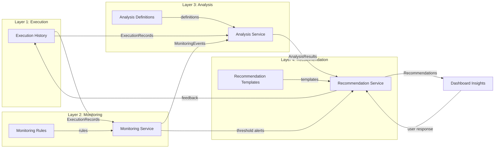

# ADR-0018: Decision Support Framework

**Status:** Approved
**Date:** 2026-07-24
**Owner:** AI & Domain Architect

## Context

HiveOS V1 collects execution history but performs no analysis on it. As V2 introduces pattern detection and learning (ADR-0002), a generic Decision Support Framework (DSF) is needed that works across all Domain Packs — accounting, HR, legal, or any future pack.

The framework must:
- Be Domain Pack agnostic (no domain-specific logic in Core)
- Produce recommendations, not decisions (ADR-0015: human ownership of truth)
- Build on V1 Execution History (the data foundation)
- Work through the existing Capability Layer (ADR-0004)
- Respect declarative Domain Packs (ADR-0001, ADR-0012: no code in packs)

## Decision

Four-layer Decision Support Framework:

```
Layer 4: Recommendation ─── Surfacing actionable suggestions to users
Layer 3: Analysis ────────── Detecting patterns, anomalies, trends
Layer 2: Monitoring ──────── Observing execution streams in near-real-time
Layer 1: Execution ───────── V1 Execution History (data collection)
```

Each layer is a Core service. Domain Packs influence behavior via declarative configuration only.

---

## Layer 1: Execution (Data Foundation)

**Already implemented in V1.** No changes needed.

Execution History Service collects immutable records of every Skill/Workflow execution with full ExecutionContext (ADR-0011). This is the raw data source for all upper layers.

| Attribute | Specification |
|-----------|--------------|
| **Data Source** | Execution History Service (append-only SQLite) |
| **Records** | ExecutionContext snapshots (inputs, outputs, prompts, responses, duration, errors, knowledge retrieved) |
| **Schema** | Existing ExecutionRecord model (07-Data-Models §3) |
| **V2 Addition** | Tagging schema: `domain_pack_id`, `skill_id`, `workflow_id`, `user_id`, `timestamp` — already present. No new fields needed. |

---

## Layer 2: Monitoring (Observation)

Near-real-time observation of execution streams. Detects anomalies and flags interesting events for the Analysis layer.

### Service: Monitoring Service

| Attribute | Specification |
|-----------|--------------|
| **Trigger** | Called after each ExecutionRecord is persisted (post-RECORDING phase) |
| **Input** | ExecutionRecord + configurable monitoring rules |
| **Output** | MonitoringEvent list (zero or more per execution) |
| **State** | Stateless — each execution evaluated independently |
| **Storage** | MonitoringEvent table in SQLite (new table) |

### Monitoring Rules

Domain Packs declare monitoring rules in YAML. Rules are generic predicates evaluated against ExecutionRecords.

```yaml
# Domain Pack declarative rule (example: accounting)
monitoring_rules:
  - id: invoice-value-anomaly
    description: "Flag invoices with unusual amounts"
    skill_filter: "accounting/validate-invoice"
    conditions:
      - field: output.invoice_amount
        operator: gt
        value: 10_000_000  # 10M Toman threshold
    severity: warning
    tags: [financial_threshold]

  - id: repeated-failure
    description: "Flag consecutive failures on same skill"
    conditions:
      - field: status
        operator: eq
        value: failed
        window: 5  # last 5 executions of same skill
        consecutive: 3
    severity: error
    tags: [reliability]
```

### Monitoring Rule Schema

```yaml
monitoring_rules:
  - id: string                    # Unique rule ID
    description: string           # Human-readable
    skill_filter: string|null     # Limit to specific skill (null = all skills)
    conditions:
      - field: string             # Dot-notation path into ExecutionRecord
        operator: eq|gt|lt|gte|lte|contains|matches|changed
        value: any                # Comparison value
        window: int|null          # Lookback window (executions)
        consecutive: int|null     # Require N consecutive matches
    severity: info|warning|error
    tags: [string]                # Classification tags for Analysis layer
```

### MonitoringEvent Model

```yaml
type: object
required: [id, rule_id, execution_id, severity, timestamp, tags]
properties:
  id: string                    # UUID
  rule_id: string               # Which monitoring rule triggered
  execution_id: string          # ExecutionRecord ID
  severity: enum[info, warning, error]
  timestamp: string             # ISO 8601
  tags: [string]                # From monitoring rule
  context: object               # Snapshot of relevant fields that triggered the event
  acknowledged: boolean         # Default false. Set by user via Dashboard.
```

### Design Rules

- Monitoring Service is synchronous — called in-process after recording.
- Rules are evaluated in declaration order. Multiple rules can fire per execution.
- No external alerts in V1. Events are visible in Dashboard only.
- Monitoring rules are read-only after Domain Pack install (ADR-0001).
- Maximum 50 rules per Domain Pack. 200 total across all packs (hard limit).

---

## Layer 3: Analysis (Pattern Detection)

Periodic batch analysis over accumulated MonitoringEvents and ExecutionRecords. Detects patterns, trends, and anomalies that span multiple executions.

### Service: Analysis Service

| Attribute | Specification |
|-----------|--------------|
| **Trigger** | Cron-based (configurable interval, default: daily) OR on-demand via Dashboard |
| **Input** | MonitoringEvents, ExecutionRecords, AnalysisDefinitions from Domain Packs |
| **Output** | AnalysisResult list |
| **State** | Stateful — maintains rolling windows and historical baselines |
| **Storage** | AnalysisResult + Baseline tables in SQLite |

### Analysis Definitions

Domain Packs declare analysis patterns in YAML. The Core provides generic analysis engines; Domain Packs configure which engines run and with what parameters.

```yaml
# Domain Pack declarative analysis (example: accounting)
analysis_definitions:
  - id: monthly-expense-trend
    engine: trend_analysis
    description: "Track monthly expense approval trends"
    inputs:
      skill_filter: "accounting/approve-expense"
      time_window: 30d
      group_by: output.category
      metric: count
    output:
      format: trend_with_baseline
      alert_on:
        - condition: deviation_pct > 20
          severity: warning

  - id: invoice-processing-efficiency
    engine: efficiency_analysis
    description: "Measure invoice processing time trends"
    inputs:
      skill_filter: "accounting/validate-invoice"
      time_window: 7d
      metric: duration_ms
    output:
      format: efficiency_report
      baseline_comparison: true
```

### Built-in Analysis Engines

The Core provides these generic engines. Domain Packs select and configure them:

| Engine | ID | Purpose | Input | Output |
|--------|-----|---------|-------|--------|
| **Trend Analysis** | `trend_analysis` | Detect directional changes in metrics over time | ExecutionRecords filtered by skill/time | Trend line, slope, deviation from baseline |
| **Frequency Analysis** | `frequency_analysis` | Count occurrences of events/values | MonitoringEvents or ExecutionRecords | Frequency distribution, outliers |
| **Correlation Analysis** | `correlation_analysis` | Find relationships between variables | ExecutionRecords with multiple fields | Correlation coefficients, significance |
| **Efficiency Analysis** | `efficiency_analysis` | Measure performance trends (duration, success rate) | ExecutionRecords | Efficiency score, trend, baseline comparison |
| **Anomaly Detection** | `anomaly_detection` | Statistical outlier detection (z-score, IQR) | Any numeric time series | Anomalies with confidence score |
| **Cluster Analysis** | `cluster_analysis` | Group similar executions | ExecutionRecords | Clusters with descriptions |

### AnalysisResult Model

```yaml
type: object
required: [id, analysis_id, timestamp, summary, findings]
properties:
  id: string                    # UUID
  analysis_id: string           # Which analysis definition produced this
  timestamp: string             # ISO 8601
  period:
    start: string               # Analysis window start
    end: string                 # Analysis window end
  summary: string               # One-paragraph human-readable summary
  findings:
    - type: enum[trend, anomaly, correlation, cluster, efficiency]
      description: string       # What was found
      confidence: number        # 0.0 to 1.0
      data: object              # Engine-specific structured data
      severity: enum[info, warning, critical]
  baseline:
    previous_value: number|null
    current_value: number|null
    deviation_pct: number|null
  metadata:
    records_analyzed: int
    engine_version: string
```

### Baseline Management

- Baselines are computed from historical AnalysisResults.
- First run establishes baseline. Subsequent runs compare against it.
- Baselines auto-update when new analysis runs (rolling window, configurable retention).
- Baselines are per `analysis_id` — each analysis definition has its own baseline.

### Design Rules

- Analysis runs are idempotent — running twice with same data produces same results.
- Analysis does NOT modify ExecutionRecords or MonitoringEvents (read-only on source data).
- Analysis runs are recorded in Execution History as special records (type: `analysis_run`).
- Maximum runtime per analysis: 5 minutes. Timeout = partial result + error flag.
- Analysis definitions are declarative (ADR-0001). No custom code in Domain Packs.

---

## Layer 4: Recommendation (Surfacing)

Generates actionable recommendations from AnalysisResults and MonitoringEvents. Presents them to users through the Dashboard. Users always have final say (ADR-0015).

### Service: Recommendation Service

| Attribute | Specification |
|-----------|--------------|
| **Trigger** | After each Analysis run completes OR when MonitoringEvents reach threshold |
| **Input** | AnalysisResults, MonitoringEvents, RecommendationTemplates from Domain Packs |
| **Output** | Recommendation list |
| **State** | Stateless per recommendation — but tracks user responses |
| **Storage** | Recommendation + UserResponse tables in SQLite |

### Recommendation Templates

Domain Packs declare recommendation templates in YAML. Templates map analysis findings to human-readable, actionable recommendations.

```yaml
# Domain Pack declarative recommendations (example: accounting)
recommendation_templates:
  - id: expense-threshold-alert
    source_analysis: monthly-expense-trend
    trigger:
      - finding_type: trend
        severity: [warning, critical]
    template:
      title: "Expense Category {{finding.data.category}} Shows Unusual Trend"
      body: |
        Over the past {{analysis.period}} days, expenses in
        **{{finding.data.category}}** have {{finding.data.direction}}
        by {{finding.data.change_pct}}%.

        Current average: {{finding.baseline.current_value}} Toman
        Historical average: {{finding.baseline.previous_value}} Toman

        Consider reviewing recent transactions in this category.
      actions:
        - label: "View Related Executions"
          type: navigation
          target: "/history?skill={{analysis.analysis_id}}&period={{analysis.period}}"
        - label: "Dismiss"
          type: dismiss

  - id: repeated-failure-recommendation
    source_monitoring: repeated-failure
    trigger:
      - monitoring_tag: reliability
        severity: [error]
    template:
      title: "Skill '{{event.skill_id}}' Has Failed {{event.count}} Times"
      body: |
        The skill **{{event.skill_id}}** has failed {{event.count}}
        times in the last {{event.window}} executions.

        Most recent error: {{event.context.last_error}}

        Check skill configuration or contact your Domain Pack author.
      actions:
        - label: "View Error Details"
          type: navigation
          target: "/history/{{event.context.last_execution_id}}"
        - label: "Acknowledge"
          type: acknowledge
```

### Recommendation Model

```yaml
type: object
required: [id, template_id, source_type, source_id, timestamp, title, body, status]
properties:
  id: string                    # UUID
  template_id: string           # Which recommendation template
  source_type: enum[analysis, monitoring]
  source_id: string             # AnalysisResult ID or MonitoringEvent ID
  timestamp: string             # ISO 8601
  title: string                 # Short actionable title
  body: string                  # Markdown body with context
  actions:
    - label: string
      type: enum[navigation, dismiss, acknowledge, approve, reject]
      target: string|null       # URL or action target
  status: enum[pending, viewed, dismissed, acted_upon]
  user_response:
    action: string|null         # Which action user took
    timestamp: string|null
    user_id: string|null
  confidence: number            # 0.0 to 1.0 — inherited from source finding
  priority: enum[low, medium, high, critical]
  expires_at: string|null       # Optional TTL
```

### User Interaction Flow

1. Recommendation appears in Dashboard "Insights" panel.
2. User views recommendation → status changes to `viewed`.
3. User takes action (approve/reject/dismiss) → status changes to `acted_upon`.
4. User response is recorded for V2+ learning feedback (ADR-0015: disagreement is learning).

### V1 Scope Limitation

Recommendation Service is **structure only** in V1. The templates, rendering, and user interaction UI exist, but:
- No LLM-generated natural language (templates are declarative).
- No autonomous action (user must always click).
- No confidence scoring (defaults to 1.0 for all recommendations).
- The actual Insight Dashboard UI panel is deferred to V2.

---

## Data Flow



## Integration with Existing Architecture

| Component | How DSF Connects |
|-----------|-----------------|
| **Skill Executor** | No changes. DSF reads from Execution History after recording phase. |
| **Workflow Runner** | No changes. Workflow executions produce ExecutionRecords like Skills. |
| **Execution History** | New table: MonitoringEvent. New table: AnalysisResult. New table: Recommendation. ExecutionRecord unchanged. |
| **Capability Service** | DSF is NOT exposed as a Capability. It's a Core service. Skills cannot invoke DSF directly. |
| **Knowledge Service** | No changes. DSF does not query knowledge. |
| **AI Provider** | No changes. DSF is rule-based in V1. No LLM calls. |
| **Domain Pack Manager** | New: validates monitoring_rules, analysis_definitions, recommendation_templates during pack install. |
| **Configuration Service** | New keys: `dsf.monitoring_interval`, `dsf.analysis_interval`, `dsf.max_recommendations` |
| **Dashboard** | New: Insights panel for viewing/dismissing recommendations. |

## New API Endpoints

| Method | Path | Purpose |
|--------|------|---------|
| GET | `/api/dsf/monitoring/events` | List MonitoringEvents (filtered) |
| GET | `/api/dsf/monitoring/events/{id}` | Get single MonitoringEvent |
| POST | `/api/dsf/monitoring/events/{id}/acknowledge` | Acknowledge event |
| GET | `/api/dsf/analysis/results` | List AnalysisResults (filtered) |
| GET | `/api/dsf/analysis/results/{id}` | Get single AnalysisResult |
| POST | `/api/dsf/analysis/run/{definition_id}` | Trigger on-demand analysis |
| GET | `/api/dsf/recommendations` | List Recommendations (filtered) |
| GET | `/api/dsf/recommendations/{id}` | Get single Recommendation |
| POST | `/api/dsf/recommendations/{id}/act` | User takes action on recommendation |
| GET | `/api/dsf/rules` | List all monitoring/analysis/recommendation rules |
| POST | `/api/dsf/rules/test` | Test a rule against historical data |

## Database Schema Additions

### MonitoringEvent Table

```sql
CREATE TABLE monitoring_events (
    id TEXT PRIMARY KEY,
    rule_id TEXT NOT NULL,
    execution_id TEXT NOT NULL,
    severity TEXT NOT NULL CHECK (severity IN ('info', 'warning', 'error')),
    timestamp TEXT NOT NULL,
    tags TEXT NOT NULL,          -- JSON array
    context TEXT NOT NULL,       -- JSON object
    acknowledged INTEGER NOT NULL DEFAULT 0,
    FOREIGN KEY (execution_id) REFERENCES execution_records(id)
);
CREATE INDEX idx_monitoring_events_rule ON monitoring_events(rule_id);
CREATE INDEX idx_monitoring_events_severity ON monitoring_events(severity);
CREATE INDEX idx_monitoring_events_timestamp ON monitoring_events(timestamp);
```

### AnalysisResult Table

```sql
CREATE TABLE analysis_results (
    id TEXT PRIMARY KEY,
    analysis_id TEXT NOT NULL,
    timestamp TEXT NOT NULL,
    period_start TEXT NOT NULL,
    period_end TEXT NOT NULL,
    summary TEXT NOT NULL,
    findings TEXT NOT NULL,      -- JSON array
    baseline TEXT,               -- JSON object (nullable for first run)
    metadata TEXT NOT NULL       -- JSON object
);
CREATE INDEX idx_analysis_results_analysis_id ON analysis_results(analysis_id);
CREATE INDEX idx_analysis_results_timestamp ON analysis_results(timestamp);
```

### Baseline Table

```sql
CREATE TABLE dsf_baselines (
    analysis_id TEXT PRIMARY KEY,
    baseline_data TEXT NOT NULL,  -- JSON object
    last_updated TEXT NOT NULL,
    sample_count INTEGER NOT NULL DEFAULT 0
);
```

### Recommendation Table

```sql
CREATE TABLE recommendations (
    id TEXT PRIMARY KEY,
    template_id TEXT NOT NULL,
    source_type TEXT NOT NULL CHECK (source_type IN ('analysis', 'monitoring')),
    source_id TEXT NOT NULL,
    timestamp TEXT NOT NULL,
    title TEXT NOT NULL,
    body TEXT NOT NULL,
    actions TEXT NOT NULL,        -- JSON array
    status TEXT NOT NULL DEFAULT 'pending'
        CHECK (status IN ('pending', 'viewed', 'dismissed', 'acted_upon')),
    user_response TEXT,           -- JSON object (nullable)
    confidence REAL NOT NULL DEFAULT 1.0,
    priority TEXT NOT NULL DEFAULT 'medium'
        CHECK (priority IN ('low', 'medium', 'high', 'critical')),
    expires_at TEXT               -- nullable
);
CREATE INDEX idx_recommendations_status ON recommendations(status);
CREATE INDEX idx_recommendations_timestamp ON recommendations(timestamp);
```

## Domain Pack Extension Points

Domain Packs add DSF behavior through three declarative sections:

| Section | Purpose | Max per Pack | Example |
|---------|---------|-------------|---------|
| `monitoring_rules` | Detect events in execution streams | 50 | Flag invoices over threshold |
| `analysis_definitions` | Configure built-in analysis engines | 20 | Monthly expense trend analysis |
| `recommendation_templates` | Map findings to actionable recommendations | 30 | Alert on unusual expense category |

All three sections are:
- Declarative YAML only (ADR-0001, ADR-0012)
- Read-only after Domain Pack install
- Validated by Domain Pack Manager on install
- Scoped to the Domain Pack's own skills (skill_filter restricts scope)

## Configuration Keys

| Key | Default | Description |
|-----|---------|-------------|
| `dsf.enabled` | `true` | Master toggle for all DSF services |
| `dsf.monitoring.enabled` | `true` | Enable Monitoring Service |
| `dsf.monitoring.max_rules` | `200` | Global maximum monitoring rules |
| `dsf.analysis.enabled` | `true` | Enable Analysis Service |
| `dsf.analysis.interval` | `24h` | Default analysis run interval |
| `dsf.analysis.max_runtime_seconds` | `300` | Timeout per analysis run |
| `dsf.analysis.max_definitions` | `100` | Global maximum analysis definitions |
| `dsf.recommendation.enabled` | `true` | Enable Recommendation Service |
| `dsf.recommendation.max_active` | `50` | Max pending recommendations shown |
| `dsf.recommendation.default_ttl` | `30d` | Auto-expire recommendations after this period |
| `dsf.recommendation.max_templates` | `100` | Global maximum recommendation templates |

## Consequences

- **Positive:** Generic framework works for any Domain Pack — accounting, HR, legal, or future domains.
- **Positive:** Fully declarative. No code in Domain Packs (ADR-0001). Domain authors configure behavior, Core provides engines.
- **Positive:** Builds directly on V1 Execution History. No data migration needed.
- **Positive:** Human control preserved. All outputs are recommendations, never autonomous actions (ADR-0015).
- **Positive:** Clear layer separation. Each layer can be developed, tested, and deployed independently.
- **Negative:** Rule-based analysis is limited. Cannot detect complex multi-variable patterns without LLM assistance (deferred to V2).
- **Negative:** Template-based recommendations lack natural language nuance. V2 can add LLM-generated summaries.
- **Negative:** Adds 4 new SQLite tables and 11 new API endpoints. Increases system complexity.
- **Negative:** Analysis runs consume CPU during batch processing. Needs scheduling to avoid peak hours.

## Trigger for Revisit

- V2 learning system needs to consume DSF outputs → extend AnalysisResult with learning signals.
- Confidence scoring mature enough for autonomous actions → revisit ADR-0016.
- Customer requests for LLM-generated natural language recommendations → add AI Provider integration to Recommendation Service.
- Multi-variable pattern detection requires LLM analysis → add AI-powered analysis engine.

## References

- ADR-0001 (Declarative Domain Packs)
- ADR-0002 (Execution Over Learning in V1)
- ADR-0004 (Capability Layer)
- ADR-0011 (Execution Context)
- ADR-0015 (Human Ownership of Business Truth)
- ADR-0016 (Confidence-Based Autonomy Threshold)
- 07-Data-Models (ExecutionRecord, ExecutionContext schemas)
- Capability Layer Specification (§8: V2+ capabilities)
- 03-Runtime-Execution (post-recording hook point)
